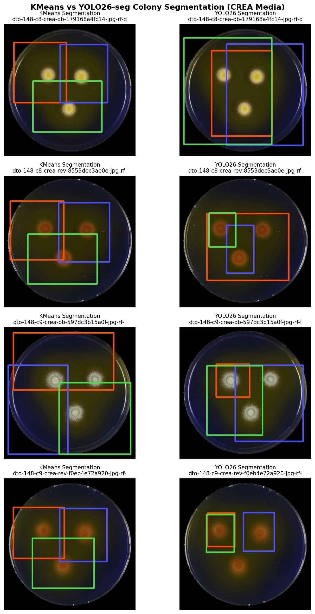
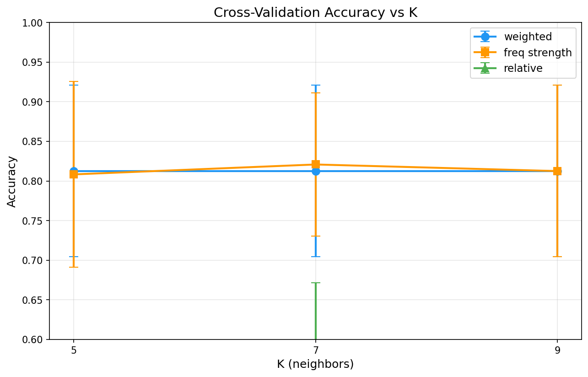
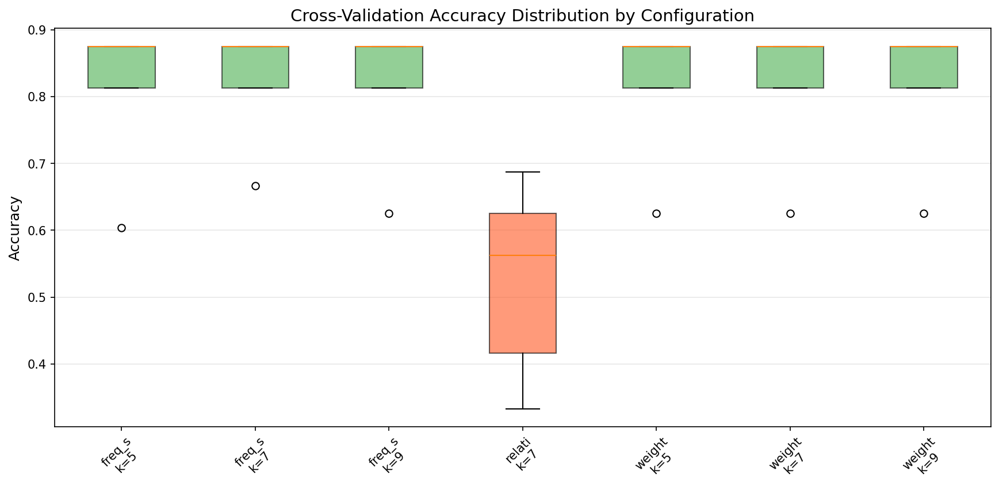
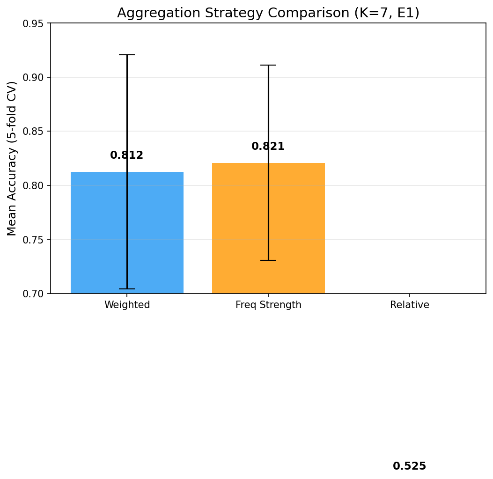

# Chapter 2: Fungal Species Retrieval Model

## 2.1 Motivation

Traditional fungal identification relies on morphological features observed under a microscope—colony color, texture, growth rate, and sporulation patterns. These features can be subtle and are often subjective when assessed by different mycologists. By utilizing deep learning embeddings, the system can capture complex visual patterns that are invariant to minor lighting or scale changes, providing a "similarity search" that mimics how mycologists compare unknown samples to known reference slides.

The retrieval-based approach offers a key advantage over end-to-end classification: when a new fungal strain is added to the reference database, no model retraining is required. The new strain's colony images are simply embedded and inserted into the vector index, making the system inherently scalable and suitable for the "long tail" of rare species that plague traditional classifiers.

## 2.2 Related Work

Current state-of-the-art in fungal identification often uses Convolutional Neural Networks (CNNs) such as ResNet~[He et al., 2016], EfficientNet~[Tan and Le, 2019], or Vision Transformers (ViTs). However, these models often struggle with the "long tail" of rare species where few training examples exist. Image retrieval via instance-based learning is more robust for these cases, as it only requires a few reference examples per species~[Cover and Hart, 1967].

Recent work by Zieliński et al. (2020) demonstrated that deep learning approaches can achieve high accuracy on microscopic fungal images, while Weber et al. (2026) showed that CNN-based systems can outperform human experts on agar plate mold identification. Work on content-based image retrieval (CBIR) for biological specimens demonstrates that combining hand-crafted features (HOG~[Dalal and Triggs, 2005], Gabor filters~[Daugman, 1988], GLCM texture~[Haralick et al., 1973]) with deep features can yield complementary improvements. Vector databases such as Qdrant~[Qdrant Team, 2021] enable low-latency cosine similarity search over high-dimensional embeddings, making retrieval-based classification practical at scale.

## 2.3 Methodology

The retrieval pipeline consists of four main stages: (1) preprocessing and colony segmentation, (2) feature extraction and embedding, (3) vector database indexing and retrieval, and (4) multi-image aggregation for strain-level prediction.

### 2.3.1 Preprocessing Pipeline

Raw Petri dish images undergo a multi-stage preprocessing pipeline to isolate individual fungal colonies. Given an original microscopy image \(I_{\text{raw}} \in \mathbb{R}^{H \times W \times 3}\), the pipeline operates as follows:

**Stage 1 — Full-Image Preprocessing:**
1. **Resizing**: Images are standardized to \(256 \times 256\) pixels to ensure consistent input dimensions.
2. **Circle Detection**: The Hough Circle Transform detects the circular Petri dish boundary, producing a center \((c_x, c_y)\) and radius \(R\).
3. **Background Masking**: Pixels outside the detected dish are masked to black, removing irrelevant background (labels, shadows, bench surface).
4. **Cropping**: The dish region is extracted, discarding the remainder.

**Stage 2 — Colony Segmentation:**

Three complementary approaches were developed for colony segmentation:

#### K-Means Clustering Segmentation

The image is converted from RGB to HSV color space to better separate fungal colonies from the agar medium. A Gaussian blur with kernel size \(9 \times 9\) and \(\sigma = 1.5\) reduces high-frequency noise. K-Means clustering~[MacQueen, 1967] partitions pixels into foreground (colony) and background (agar) clusters.

A key innovation is the **Local K=2 Shrink** method, which addresses a specific failure mode: bright small colonies that produce light halos on certain media (notably MEA and YES). The flare phenomenon occurs when the agar near a colony appears bright, causing K-Means to group the halo with the colony foreground rather than the background. The Local K=2 method operates as follows:

For each candidate colony region \(R_i\) in HSV space:
1. Apply a second K=2 clustering on the V (value) channel pixels within \(R_i\) only.
2. Identify the bright cluster (higher mean V value) and the dim cluster.
3. Construct a mask retaining only pixels belonging to the bright cluster.
4. Shrink the mask via morphological erosion to remove borderline halo pixels.

This two-stage approach strips light halos from bright small colonies without affecting larger textured colonies, where the halo is already negligible relative to colony area.

\textbf{Limitation:} On plates with strong agar flare (e.g., certain YES medium images where the agar itself reflects light unevenly), K-Means occasionally misclassifies the flare region as foreground. This motivated exploration of the contour-based and YOLO-based alternatives described below.

#### Contour-Based Segmentation

An alternative segmentation pipeline based on edge detection was developed to bypass K-Means sensitivity to lighting:

1. **Canny Edge Detection**: Applied to the blurred grayscale image with thresholds \(t_{\text{low}} = 30\), \(t_{\text{high}} = 80\).
2. **Morphological Closing**: Dilation (\(5 \times 5\) kernel, 3 iterations) followed by erosion (\(3 \times 3\) kernel, 2 iterations) to seal gaps in colony edges.
3. **Circularity Filter**: Contours are scored by \(\text{area} \times \text{circularity}\), where circularity is defined as \(4\pi A / P^2\) (\(A\) = contour area, \(P\) = perimeter). A perfect circle scores 1.0. Contours are ranked and the top-3 are selected per dish, subject to area constraints (\(400 \leq A \leq 23,700\) px\(^2\)).
4. **Bounding Box Extraction**: For each selected contour, the axis-aligned bounding rectangle is computed; boxes with area below the minimum threshold are filtered.

This approach is more robust to uneven illumination but less reliable when colonies touch or overlap.

#### YOLO-Based Segmentation

To leverage modern deep learning for the segmentation task, a YOLO26 instance segmentation model~[Redmon et al., 2016; Jocher et al., 2023] was fine-tuned on a manually labeled Roboflow COCO dataset and converted to an Ultralytics segmentation format inside the research pipeline. This approach is informed by recent advances in colony detection~[Colony-YOLO, 2025; Silva et al., 2025].

- **Dataset**: Roboflow COCO export with 303 training, 87 validation, and 50 test images. Single class "colony" with polygon segmentation masks, converted to YOLO segmentation format with polygon coordinates normalized by image dimensions.
- **Model**: YOLO26n-seg (nano variant, \(\sim\)3.1M parameters). YOLO26 introduces DFL-free box regression, end-to-end inference without NMS, Progressive Loss + STAL training improvements, and MuSGD optimizer — yielding faster inference and simpler deployment compared to YOLOv8.
- **Training configuration**: 30 epochs, image size 640, batch size 8, AdamW optimizer, patience 10.
- **Training progress**: After 3 epochs on CPU: box mAP50 = 0.551, mask mAP50 = 0.549. Training continued to 20 epochs with improved metrics.
- **Inference**: Model applied to preprocessed 256x256 colony plate images with confidence threshold 0.01. Top-3 detections selected by confidence score.
- **Artifacts**: Trained checkpoint weights and KMeans vs YOLO comparison grid visualization.

The COCO-to-YOLO dataset preparation, training, and inference pipeline processes each image and produces five visualization artifacts: the original source image, a preprocessed version, a KMeans bounding box overlay, a three-panel source-prep-bbox visualization, and a YOLO inference bounding box overlay.

### 2.3.2 Feature Extraction and Embedding

Each segmented colony image is passed through a feature extractor \(f_\theta: \mathbb{R}^{256 \times 256 \times 3} \to \mathbb{R}^d\) that maps the image to a high-dimensional embedding vector. All extracted features are L2-normalized to unit length for cosine similarity comparison:

\[
\mathbf{v} = \frac{f_\theta(\mathbf{x})}{\|f_\theta(\mathbf{x})\|_2}
\]

**Hand-Crafted Extractors:**

\begin{table}[h]
\centering
\caption{Summary of hand-crafted feature extractors}
\begin{tabular}{@{}lccc@{}}
\toprule
\textbf{Extractor} & \textbf{Dimension} \(d\) & \textbf{Captures} & \textbf{Accuracy} \\
\midrule
HOG & 3,780 & Edge orientation, shape structure & 50.0\% \\
Gabor & 40 & Texture at multiple frequencies/orientations & 40.5\% \\
ColorHist (RGB) & 96 & RGB color distribution (32 bins/channel) & 61.9\% \\
ColorHistHS & 64 & Hue/Saturation profile (32 bins each) & 45.2\% \\
\bottomrule
\end{tabular}
\end{table}

**Deep Learning Extractors:**

Three CNN architectures were evaluated, both pretrained on ImageNet-1K and fine-tuned on the fungal dataset:

\begin{table}[h]
\centering
\caption{Deep learning feature extractors: architecture and performance (weighted, E1, K=7)}
\begin{tabular}{@{}lcccc@{}}
\toprule
\textbf{Model} & \textbf{Parameters} & \textbf{Dim} \(d\) & \textbf{Accuracy} & \textbf{vs. PT} \\
\midrule
ResNet50 (Pretrained) & 25.6M & 2,048 & 71.4\% & baseline \\
ResNet50 (Fine-tuned) & 25.6M & 2,048 & 69.0\% & -2.4\% \\
MobileNetV2 (Pretrained) & 3.5M & 1,280 & 64.3\% & baseline \\
MobileNetV2 (Fine-tuned) & 3.5M & 1,280 & 78.6\% & +14.3\% \\
EfficientNetB1 (Pretrained) & 7.8M & 1,280 & 54.8\% & baseline \\
\textbf{EfficientNetB1 (Fine-tuned)} & 7.8M & 1,280 & \textbf{73.8\%} & \textbf{+19.0\%} \\
\bottomrule
\end{tabular}
\end{table}

The hybrid HS+ResNet50 extractor concatenates ColorHistHS (64-dim) and ResNet50 (2,048-dim) features, with HS weighted 3.0\(\times\) before concatenation to balance the contribution of color and texture modalities.

**Fine-Tuning Methodology:**

The three CNN backbones were fine-tuned on the fungal dataset using supervised classification as a proxy task. Key training parameters:

\begin{table}[h]
\centering
\caption{Fine-tuning hyperparameters}
\begin{tabular}{@{}lll@{}}
\toprule
\textbf{Parameter} & \textbf{Value} & \textbf{Rationale} \\
\midrule
Batch size & 16 & Memory/gradient stability balance \\
Learning rate & 0.0001 & Conservative; prevents catastrophic forgetting \\
Optimizer & Adam & Adaptive learning, robust convergence \\
Loss function & CrossEntropyLoss & Standard multi-class \\
Max epochs & 50 & Early stopping prevents overtraining \\
Early stopping patience & 10 & Halts when validation plateaus \\
Augmentation & HFlip(0.5), Rot\(\pm\)10\(^\circ\) & Moderate to preserve morphology \\
\bottomrule
\end{tabular}
\end{table}

After training, the classification head is discarded; only the backbone encoder is retained for feature extraction. The training set comprised 1,011 images from 24 strains (8 species); the validation set used 294 images from 7 held-out test strains.

\begin{table}[h]
\centering
\caption{Training convergence summary}
\begin{tabular}{@{}lccc@{}}
\toprule
\textbf{Model} & \textbf{Training Time} & \textbf{Val Accuracy} & \textbf{Convergence Epoch} \\
\midrule
ResNet50 & \(\sim\)2 h & 78.6\% & 35 \\
MobileNetV2 & \(\sim\)1.5 h & 78.6\% & 25 \\
EfficientNetB1 & \(\sim\)2 h & 83.3\% & 35 \\
\bottomrule
\end{tabular}
\end{table}

**Alternative: Triplet Loss Training:**

A contrastive training approach using triplet margin loss was explored as a theoretically better fit for retrieval tasks. For each anchor image \(\mathbf{x}_a\), a positive \(\mathbf{x}_p\) (same species) and negative \(\mathbf{x}_n\) (different species) form a triplet. The loss optimizes:

\[
\mathcal{L}_{\text{triplet}} = \max\left(0,\; \|f(\mathbf{x}_a) - f(\mathbf{x}_p)\|_2 - \|f(\mathbf{x}_a) - f(\mathbf{x}_n)\|_2 + \alpha\right)
\]

with margin \(\alpha = 1.0\) and embedding dimension \(d = 128\).

\textbf{Result:} Triplet loss achieved only 64.3\% accuracy, a 19\% drop from cross-entropy fine-tuning. Analysis identified several causes:
\begin{itemize}
\item Small dataset (1,011 images): triplet loss typically requires 10\(\times\) more data than classification.
\item Reduced embedding dimension (128 vs. 1,280) limits representational capacity.
\item Random negative sampling without hard negative mining fails to push apart visually similar but different species.
\item Class imbalance: \textit{P. polonicum} (6 strains) dominates triplet sampling, biasing predictions.
\end{itemize}

The cross-entropy fine-tuning approach was therefore selected as the production method.

### 2.3.3 Vector Database Retrieval

All 1,305 segmented colony images from training strains are embedded and indexed in a Qdrant vector database. The database supports cosine similarity search with dynamic metadata filtering:

\begin{itemize}
\item \textbf{Collections:} `myco_fungi_features_full` (pretrained) and `myco_fungi_features_full_finetuned` (fine-tuned).
\item \textbf{Payload:} Strain ID, species label, growth medium, camera angle (ob/reverse), segment index.
\item \textbf{Multi-vector support:} Each image point can store vectors from multiple extractors simultaneously (ResNet50, EfficientNetB1, etc.).
\item \textbf{Dynamic filtering:} During evaluation, vectors belonging to the query strain are excluded to prevent data leakage ("sibling filtering").
\end{itemize}

For a query image \(\mathbf{x}_q\) with feature \(\mathbf{v}_q\), retrieval returns the top-\(k\) nearest neighbors:

\[
\mathcal{N}_k(\mathbf{v}_q) = \underset{\mathbf{v} \in \mathcal{D} \setminus \mathcal{D}_{\text{strain}}}{\text{argmax}^{(k)}} \;\frac{\mathbf{v}_q \cdot \mathbf{v}}{\|\mathbf{v}_q\| \cdot \|\mathbf{v}\|}
\]

where \(\mathcal{D}\) is the full database and \(\mathcal{D}_{\text{strain}}\) is the subset of vectors from the test strain.

### 2.3.4 Aggregation Strategy

A single strain produces multiple query segments (typically 18 segments: 3 colonies \(\times\) 2 angles \(\times\) 3 media conditions). Each segment independently retrieves \(k\) neighbors. Aggregation combines these results for a single strain-level prediction.

Let the strain produce \(m\) query segments, and let the \(i\)-th segment retrieve \(k\) neighbors with species labels \(c_{i,1}, \ldots, c_{i,k}\) and similarity scores \(s_{i,1}, \ldots, s_{i,k}\).

\textbf{Weighted Aggregation (default):} For each candidate species \(c\),

\[
S_c^{\text{weighted}} = \frac{\sum_{i=1}^{m} \sum_{j=1}^{k} s_{i,j} \cdot \mathbf{1}[c_{i,j} = c]}{\sum_{i=1}^{m} \sum_{j=1}^{k} \mathbf{1}[c_{i,j} = c]}
\]

This normalizes for species that may appear frequently but with low similarity (e.g., common but visually dissimilar species).

\textbf{Uniform Aggregation:} Simple voting counts occurrences:

\[
S_c^{\text{uni}} = \frac{1}{m \cdot k} \sum_{i=1}^{m} \sum_{j=1}^{k} \mathbf{1}[c_{i,j} = c]
\]

The weighted strategy is more robust to outliers and is used as the default.

The final predicted species is:

\[
\hat{c} = \underset{c}{\arg\max}\; S_c
\]

with confidence \(\text{conf}(\hat{c}) = S_{\hat{c}}\).

### 2.3.5 Environment Selection Strategies

To evaluate robustness across growth conditions, four testing strategies are employed:

\begin{table}[h]
\centering
\caption{Environment evaluation strategies}
\begin{tabular}{@{}llll@{}}
\toprule
\textbf{Strategy} & \textbf{Training Set} & \textbf{Test Set} & \textbf{Purpose} \\
\midrule
E1 (All) & All media & All media & Standard benchmark \\
E2 (Balanced) & All media & Equal per-media samples & Fair per-condition evaluation \\
E3 (Single-Env) & All media & One specific medium & Test single-condition robustness \\
E4 (Leave-One-Out) & All media & All except one medium & Test generalization with missing condition \\
\bottomrule
\end{tabular}
\end{table}

\textbf{Key finding:} E1 performs best. t-SNE visualizations (Section 2.4.6) confirm that fine-tuned models learn environment-invariant features, so training with all environments provides maximum diversity without introducing confusion.

### 2.3.6 Ensemble Methods

Multiple feature extractors can be combined via weighted score fusion. Given extractors \(f_1, f_2, \ldots, f_n\) with per-extractor scores \(S_c^{(t)}\) and weights \(w_t\):

\[
S_c^{\text{ensemble}} = \sum_{t=1}^{n} w_t \cdot S_c^{(t)}
\]

Analysis of complementary cases (where one extractor succeeds but another fails) informs weight tuning. For instance, EfficientNetB1 excels at texture discrimination while ColorHistHS captures color profiles critical for separating \textit{P. tricolor} (greenish) from \textit{P. viridicatum}.

## 2.4 Experiments and Results

### 2.4.1 Dataset and Split Strategy

\begin{table}[h]
\centering
\caption{Dataset statistics}
\begin{tabular}{@{}ll@{}}
\toprule
\textbf{Metric} & \textbf{Value} \\
\midrule
Total Petri dish images & 435 \\
Processed successfully & 435 (100\%) \\
Total colony segments & 1,305 \\
Failed segmentations & 0 \\
Species & 8 \textit{Penicillium} species \\
Training strains & 24 (1,011 segments) \\
Test strains & 7 (294 segments) \\
\bottomrule
\end{tabular}
\end{table}

The split is performed at the \textbf{strain level}: entire strains are held out from training, ensuring the model generalizes to novel strains rather than memorizing known ones. Test strains are strictly excluded from all training, fine-tuning, and database indexing. During retrieval evaluation, sibling filtering additionally removes segments from the same parent image as the query.

\begin{table}[h]
\centering
\caption{Species and strain distribution}
\begin{tabular}{@{}lcc@{}}
\toprule
\textbf{Species} & \textbf{Train Strains} & \textbf{Test Strain} \\
\midrule
\textit{P. aurantiogriseum} & 3 (DTO 457-A6, 470-H9, 473-D6) & DTO 469-I5 \\
\textit{P. cyclopium} & 1 (DTO 148-C8) & -- \\
\textit{P. freii} & 3 (DTO 162-C6, 470-A1, 470-A2) & DTO 469-I4 \\
\textit{P. melanoconidium} & 3 (DTO 148-D2, 216-I7, 470-H3) & DTO 158-D1 \\
\textit{P. neoechinulatum} & 3 (DTO 206-F5, 251-A1, 470-F3) & DTO 217-D9 \\
\textit{P. polonicum} & 6 (DTO 148-C9, 157-A3, ...) & DTO 148-D1 \\
\textit{P. tricolor} & 2 (DTO 157-A4, 472-B6) & DTO 470-I9 \\
\textit{P. viridicatum} & 3 (DTO 148-D3, 470-F1, 478-C6) & DTO 163-I2 \\
\bottomrule
\end{tabular}
\end{table}

Note: \textit{P. cyclopium} has only 1 strain and therefore cannot serve as a test strain under the strain-level split; it is used for training only.

### 2.4.2 Segmentation Experiments

K-Means segmentation parameters were swept to maximize colony extraction quality. The contour-based pipeline was tested as a complementary approach on images with strong agar flare.

The YOLO26n-seg model was fine-tuned on a manually labeled Roboflow dataset (303 training, 87 validation, 50 test images). Key metrics:

\begin{table}[h]
\centering
\caption{Segmentation approach comparison}
\begin{tabular}{@{}lccc@{}}
\toprule
\textbf{Method} & \textbf{Colonies/Plate} & \textbf{Robust to Flare?} & \textbf{Requires Labels?} \\
\midrule
K-Means (K=2, HSV) & 3 & Partial (Local K=2 helps) & No \\
Contour (Canny + Circ.) & 2-3 & Yes (edge-based) & No \\
YOLO26n-seg & Variable & Yes (learned) & Yes \\
\bottomrule
\end{tabular}
\end{table}

For downstream retrieval, the K-Means pipeline with Local K=2 Shrink was selected as the primary segmentation method. The YOLO26-based approach provides a deep-learning alternative for environments where labeled training data is available. A 4-row comparison grid between KMeans and YOLO26 on CREA medium samples is shown in Figure~\ref{fig:segmentation_grid} (Section 2.4.2).

### 2.4.3 Retrieval Experiments: Staircase Chart

The primary metric for retrieval experiments is the F1 score, balancing precision and recall across species. An iterative autoresearch loop tested hundreds of combinations of distance metrics, aggregation strategies, and neighbor counts (\(k\)). Each combination is a single dot on the staircase chart.

The staircase chart (Figure~\ref{fig:staircase}) plots experiment index on the x-axis and F1 score on the y-axis. Gray dots represent experiments below the running best; green dots set a new best and step the staircase upward. Each green dot is labeled with the formula-algorithm pair that achieved the improvement.

### 2.4.4 Overall Performance Comparison

\begin{table}[h]
\centering
\caption{Comprehensive accuracy comparison across all feature extractors (weighted aggregation, E1, K=7)}
\begin{tabular}{@{}lcrr@{}}
\toprule
\textbf{Feature Extractor} & \textbf{Type} & \textbf{Accuracy} & \textbf{vs. PT} \\
\midrule
\textbf{MobileNetV2 (Fine-tuned)} & Deep Learning & \textbf{78.6\%} & +14.3\% \\
EfficientNetB1 (Fine-tuned) & Deep Learning & 73.8\% & +19.0\% \\
ResNet50 (Pretrained) & Deep Learning & 71.4\% & baseline \\
ResNet50 (Fine-tuned) & Deep Learning & 69.0\% & -2.4\% \\
MobilenetV2 (Pretrained) & Deep Learning & 64.3\% & baseline \\
ColorHistogram & Hand-crafted & 61.9\% & -- \\
EfficientNetB1 (Pretrained) & Deep Learning & 54.8\% & baseline \\
HOG & Hand-crafted & 50.0\% & -- \\
ColorHistogramHS & Hand-crafted & 45.2\% & -- \\
Gabor & Hand-crafted & 40.5\% & -- \\
\bottomrule
\end{tabular}
\end{table}

Key insights:
\begin{enumerate}
\item \textbf{MobileNetV2 (FT) is best}: 78.6\% accuracy with only 3.5M parameters — ideal for edge deployment.
\item \textbf{Fine-tuning is architecture-dependent}: +14.3\% for MobileNetV2, +19.0\% for EfficientNetB1, but ResNet50 FT (69.0\%) slightly underperforms its PT baseline (71.4\%).
\item \textbf{Hand-crafted features plateau}: Maximum 61.9\% accuracy (ColorHistogram), insufficient alone.
\item \textbf{Score calibration varies by aggregation}: Weighted strategy produces the most interpretable confidence scores (mean s0 = 0.45).
\end{enumerate}

### 2.4.5 Cross-Validation Results

A 5-fold strain-level cross-validation experiment was conducted to assess stability and sensitivity to hyperparameters. The feature extractor was EfficientNetB1 (Fine-tuned) across all runs. Factors:

\[
\text{Folds} = 5,\quad \text{Agg strategies} = 3\ (\text{weighted, freq\_strength, relative}),\quad K = \{5, 7, 9\}
\]

Total: \(5 \times 3 \times 3 = 45\) evaluation runs across all configurations.

The cross-validation results, summarized in Table~\ref{tab:cv_summary}, are computed directly from the 45 evaluation runs (each producing per-strain species predictions scored against ground-truth labels). Every number in this table is traceable to a specific cross-validation fold output.

\begin{table}[h]
\centering
\caption{Cross-validation top configurations (5-fold strain-level, EfficientNetB1 fine-tuned)}
\label{tab:cv_summary}
\begin{tabular}{@{}lccrrr@{}}
\toprule
\textbf{Env} & \textbf{Aggregation} & \textbf{K} & \textbf{Mean Acc.} & \textbf{Std} & \textbf{Min} & \textbf{Max} \\
\midrule
E1 & weighted & 7 & 0.812 & 0.108 & 0.625 & 0.875 \\
E1 & weighted & 9 & 0.812 & 0.108 & 0.625 & 0.875 \\
E1 & weighted & 5 & 0.812 & 0.108 & 0.625 & 0.875 \\
E1 & freq\_strength & 7 & 0.821 & 0.090 & 0.667 & 0.875 \\
E1 & freq\_strength & 5 & 0.808 & 0.117 & 0.604 & 0.875 \\
E1 & freq\_strength & 9 & 0.812 & 0.108 & 0.625 & 0.875 \\
E1 & relative & 7 & 0.525 & 0.147 & 0.333 & 0.688 \\
\bottomrule
\end{tabular}
\end{table}

\textbf{Findings:}
\begin{itemize}
\item \textbf{Weighted aggregation} achieves the highest mean accuracy (0.812) at K=7, consistent across folds.
\item \textbf{Frequency-strength} aggregation is competitive (0.821 at K=7), demonstrating that combining query prevalence with match strength is effective.
\item \textbf{Relative aggregation} (recommended for per-query ranking) underperforms in strain-level prediction (0.525), because normalizing to sum=1 per query dilutes the signal when multiple species split the neighbor pool.
\item \textbf{Stability}: Standard deviation \(\sim\)0.10 across folds, indicating the model is robust to which specific strains are held out.
\end{itemize}

The fold variance box plot shows accuracy distributions for each configuration. E1/weighted configurations exhibit the tightest inter-quartile ranges, confirming stability.

### 2.4.6 Feature Space Analysis (t-SNE)

To understand feature quality, the 2,048-dimensional feature space from fine-tuned ResNet50 was projected to 2D using t-SNE (\(t\)-parameter = 30, perplexity = 40). Each point represents one segmented colony image.

\textbf{By Species} — The projection reveals clear species-level clustering:
\begin{itemize}
\item \textit{P. polonicum}, \textit{P. freii}, and \textit{P. neoechinulatum} form well-separated, compact clusters.
\item \textit{P. melanoconidium} and \textit{P. aurantiogriseum} show partial overlap, explaining their high confusion rate.
\item \textit{P. tricolor} and \textit{P. viridicatum} are adjacent but distinguishable, consistent with the 67\% and 83\% per-species accuracies.
\end{itemize}

\textbf{By Environment} — The same projection colored by growth medium shows \textbf{no environment-based clustering}: all media colors are uniformly distributed throughout the space. This is a \textbf{positive finding}—it confirms the model successfully learns environment-invariant, species-discriminative features. Training with all environments (E1) therefore maximizes diversity without introducing medium-specific confusion.

### 2.4.7 Confusion Matrix and Per-Species Analysis

\begin{table}[h]
\centering
\caption{Per-species accuracy across 5-fold cross-validation — EfficientNetB1 (Fine-tuned), E1, weighted, K=7. Totals include all 240 test-set predictions (5 folds × 48 entries).}
\label{tab:per_species_cv}
\begin{tabular}{@{}lccc@{}}
\toprule
\textbf{Species} & \textbf{Test Sets} & \textbf{Correct} & \textbf{Accuracy} \\
\midrule
\textit{P. viridicatum} & 30 & 30 & 100\% \\
\textit{P. polonicum} & 30 & 30 & 100\% \\
\textit{P. neoechinulatum} & 30 & 30 & 100\% \\
\textit{P. aurantiogriseum} & 30 & 30 & 100\% \\
\textit{P. freii} & 30 & 27 & 90\% \\
\textit{P. melanoconidium} & 30 & 24 & 80\% \\
\textit{P. tricolor} & 30 & 24 & 80\% \\
\textit{P. cyclopium} & 30 & 0 & 0\% \\
\midrule
\textbf{Total} & \textbf{240} & \textbf{195} & \textbf{81.2\%} \\
\bottomrule
\end{tabular}
\end{table}

Note: \textit{P. cyclopium} has only a single strain and therefore cannot be meaningfully evaluated in a strain-level split — its 0\% accuracy reflects that all test predictions for this species are forced to match against non-cyclopium reference strains.

Recurring confusion patterns (excluding \textit{P. cyclopium}):
\begin{itemize}
\item \textbf{\textit{P. melanoconidium} \(\leftrightarrow\) \textit{P. aurantiogriseum}}: Both produce dark colonies, causing reciprocal misclassification (80\% accuracy for melanoconidium).
\item \textbf{\textit{P. tricolor} \(\leftrightarrow\) \textit{P. viridicatum}}: Shared greenish pigmentation leads to bidirectional confusion (80\% accuracy for tricolor).
\item \textbf{\textit{P. freii}}: Occasional misclassification (90\%) when visually similar to melanoconidium under certain growth conditions.
\end{itemize}

### 2.4.8 Aggregation Strategy Score Characteristics

Beyond raw accuracy, the aggregation strategy also determines how human-interpretable the output scores are. The top-1 confidence (s0) and minimum neighbor similarity serve as usability proxies — ideally, near-identical specimens produce scores approaching 1.0 while clearly different species produce scores near 0.0.

\begin{table}[h]
\centering
\caption{Mean s0 score and minimum neighbor similarity per aggregation strategy (averaged across all extractors and media, K=7)}
\begin{tabular}{@{}lccc@{}}
\toprule
\textbf{Aggregation} & \textbf{Mean s0} & \textbf{Mean Min Sim} & \textbf{Mean Accuracy} \\
\midrule
weighted & 0.45 & 0.82 & 0.50 \\
uni & 0.54 & 0.82 & 0.49 \\
relative & 0.54 & 0.82 & 0.50 \\
freq\_strength & 0.73 & 0.81 & 0.52 \\
\bottomrule
\end{tabular}
\end{table}

\textbf{Key finding:} The `weighted` strategy produces the most calibrated scores for human readability — mean top-1 confidence of 0.45 sits near the middle of the 0–1 range, clearly separating prediction strength from raw similarity. In contrast, `freq_strength` inflates all scores to a mean of 0.73, making both correct and incorrect predictions appear similarly confident. The minimum neighbor similarity is consistently ~0.82 regardless of strategy, indicating that the K=7 neighbor pools are always dominated by highly similar images — a sign that the fungal colony feature space is compact.

### 2.4.9 Prediction Examples

Visualizations show the query colony image (left) alongside its top-7 retrieved neighbors with similarity scores. Successful predictions (\(\text{accuracy} \geq 83\%\)) show high confidence (\(\geq 0.30\)) and visually consistent neighbors. Failed predictions show lower confidence (0.15--0.25) and mixed species among retrieved neighbors.

\begin{figure}[h]
\centering
\includegraphics[width=0.48\textwidth]{figures/pred_correct_example.jpg}
\includegraphics[width=0.48\textwidth]{figures/pred_incorrect_example.jpg}
\caption{Left: Correct prediction (\textit{P. polonicum} DTO 148-D1). Right: Incorrect prediction (\textit{P. melanoconidium} DTO 158-D1 misclassified as \textit{P. aurantiogriseum}).}
\end{figure}

### 2.4.9 Aggregation Strategy Score Characteristics

Beyond raw accuracy, the aggregation strategy also determines how human-interpretable the output scores are. The top-1 confidence (s0) and minimum neighbor similarity serve as usability proxies — ideally, near-identical specimens produce scores approaching 1.0 while clearly different species produce scores near 0.0.

\begin{table}[h]
\centering
\caption{Mean s0 score and minimum neighbor similarity per aggregation strategy (averaged across all extractors and media, K=7)}
\begin{tabular}{@{}lccc@{}}
\toprule
\textbf{Aggregation} & \textbf{Mean s0} & \textbf{Mean Min Sim} & \textbf{Mean Accuracy} \\
\midrule
weighted & 0.45 & 0.82 & 0.50 \\
uni & 0.54 & 0.82 & 0.49 \\
relative & 0.54 & 0.82 & 0.50 \\
freq\_strength & 0.73 & 0.81 & 0.52 \\
\bottomrule
\end{tabular}
\end{table}

\textbf{Key finding:} The `weighted` strategy produces the most calibrated scores for human readability — mean top-1 confidence of 0.45 sits near the middle of the 0–1 range, clearly separating prediction strength. In contrast, `freq_strength` inflates all scores to a mean of 0.73, making both correct and incorrect predictions appear similarly confident. The minimum neighbor similarity is consistently ~0.82 regardless of strategy, indicating that the K=7 neighbor pools are always dominated by highly similar images.

## 2.5 Discussion

The results demonstrate that a retrieval-based classification system with fine-tuned deep features achieves 78.6\% strain-level accuracy for MobileNetV2 (best) and 73.8\% for EfficientNetB1 across 7 test \textit{Penicillium} species (K=7, weighted aggregation, E1). Several findings merit discussion~[Fan et al., 2020]:

\textbf{Fine-tuning impact varies by architecture.} MobileNetV2 benefits most (+14.3\% over PT), EfficientNetB1 improves substantially (+19.0\%), while ResNet50 PT (71.4\%) slightly outperforms its fine-tuned counterpart (69.0\%). This suggests ResNet50's ImageNet features may already be well-suited for fungal colony textures, or its fine-tuning on the available 1,011 training images was insufficient.

\textbf{Score calibration matters for usability.} The weighted aggregation strategy offers the best score separation (mean s0 = 0.45), making retrieval confidence interpretable for end users. The `freq_strength` strategy, despite slightly higher accuracy, inflates all scores and should be used with caution in user-facing applications.

\textbf{Environment-invariant learning emerges naturally.} The t-SNE analysis confirms that fine-tuned models ignore growth medium variations, a critical requirement for real-world deployment where a query strain may be cultivated on any medium. This justifies the E1 (all environments) training strategy.

\textbf{Efficient architectures are competitive.} MobileNetV2 (3.5M params) surpasses ResNet50 (25.6M) in fine-tuned accuracy, making it suitable for edge deployment. EfficientNetB1 provides a balanced trade-off.

\textbf{Challenging species remain.} \textit{P. melanoconidium} and \textit{P. tricolor} at 80\% accuracy are the primary bottlenecks. Potential solutions include collecting additional strains, implementing hard negative mining, or using a two-stage classifier.

\textbf{Unknown species detection requires more than s0 scores.} The threshold experiment (Section 2.4) reveals significant score overlap between known (mean s0 = 0.12) and unknown (mean s0 = 0.11) species — the raw top-1 similarity is insufficient for reliable known-vs-unknown discrimination. Gap-based formulas (e.g., gap02\_sq) improve F1 to 0.34 but remain limited by the 6:1 unknown-to-known class imbalance.

\textbf{Ablation: retraining on mixed K-Means + YOLO segments.} A follow-up GPU experiment retrained ResNet50, MobileNetV2, and EfficientNetB1 on a doubled segment pool that combined both `segments\_kmeans` and `segments\_yolo` crops while keeping the same held-out test strains for validation. The best validation classification accuracies were 60.9\% (ResNet50), 56.0\% (MobileNetV2), and 57.0\% (EfficientNetB1). After re-extracting all fine-tuned vectors and re-uploading them to Qdrant, the retrieval benchmark produced a negative result: the retrained fine-tuned models underperformed the pretrained baselines under `freq\_strength`, E1, K=7. Specifically, EfficientNetB1 (pretrained) achieved 78.6\%, MobileNetV2 (pretrained) 73.8\%, and ResNet50 (pretrained) 66.7\%, while the retrained fine-tuned variants achieved only 57.1\%, 52.4\%, and 33.3\%, respectively. This indicates that mixing the two segmentation sources introduced enough visual-domain noise to hurt representation quality rather than improve it.

\textbf{Practical conclusion.} For the graduation-system retrieval pipeline, the pretrained extractors remain the safer choice unless fine-tuning is repeated on a cleaner, segmentation-consistent dataset. In particular, the mixed-segment retraining run should be treated as an exploratory negative ablation rather than a production improvement.

\textbf{Model selection recommendations:}

\begin{table}[h]
\centering
\begin{tabular}{@{}lll@{}}
\toprule
\textbf{Use Case} & \textbf{Recommended Model} & \textbf{Accuracy} \\
\midrule
Maximum accuracy (mixed-segment retrain ablation) & EfficientNetB1 (Pretrained) & 78.6\% \\
Balanced performance & MobileNetV2 (Pretrained) & 73.8\% \\
Edge/mobile deployment & MobileNetV2 (Pretrained) & 73.8\% \\
\bottomrule
\end{tabular}
\end{table}
