# Chapter 3: Web Application

## 3.1 Requirements Analysis

The web application translates the MycoAI Retrieval model into a governed, multi-role product supporting two actor classes: **User** (retrieval operator) and **Data Owner** (governance operator). Requirements are defined in `docs/SRS.md` and elaborated across 13 technical design documents in `docs/technical_spec/` and 8 feature specifications in `docs/feature_spec/`.

### 3.1.1 Actor Model and Permissions

| Actor | Role Value | Capabilities |
|-------|-----------|--------------|
| **User** | `user` | Upload images, retrieve species predictions, review/edit bounding boxes, download batch results, submit feedback/contribution proposals |
| **Data Owner** | `owner` | All User capabilities plus: index reference data, CRUD species/media metadata, browse/manage dataset, review feedback, re-index Qdrant, assess/promote Candidate Models, manage users and roles |

The Data Owner role inherits all User permissions. A permission matrix enforced at both the API layer (403 Forbidden) and the UI layer (conditional rendering) gates every endpoint. Backend RBAC is implemented at `backend/src/auth.py` using FastAPI `Depends(get_current_user)` and `require_role("owner")` dependency chains. The frontend at `frontend/src/App.tsx` conditionally renders owner-restricted pages.

### 3.1.2 Use Case Diagram

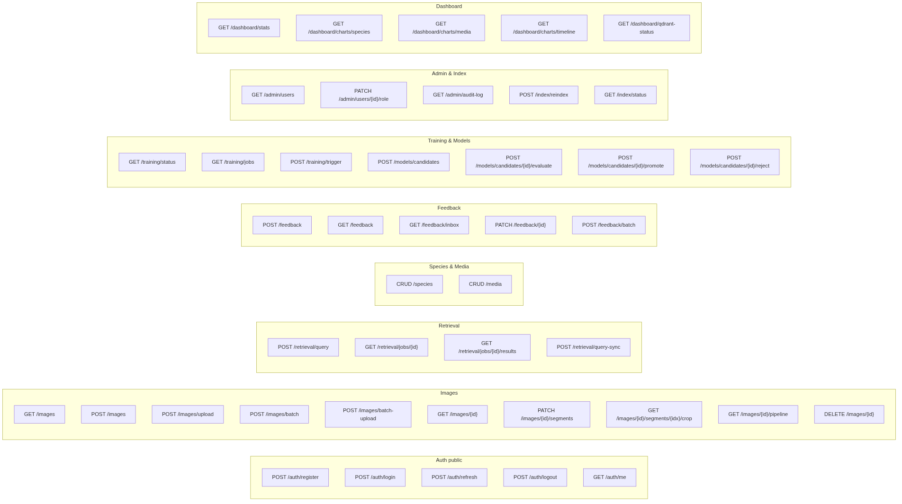  
*Figure 3.1: UML Use Case Diagram for MycoAI Retrieval — User and Data Owner actors with shared segmentation pipeline. Source defined in `docs/SRS.md` section 5.*

> **Screenshot Placeholder — Figure 3.1 (alt): Dedicated Use Case Diagram**
>
> The dedicated use case diagram should be rendered separately from `docs/SRS.md` section 5. After capturing, rename to `figures/ch03_usecase_diagram.png` and update this reference.

### 3.1.3 Functional Requirements Summary

Key functional requirements driving the web application implementation:

| FR ID | Requirement | Implementation Status |
|-------|------------|-----------------------|
| FR-001 | JWT authentication for all protected workflows | `backend/auth.py` — OAuth2 password flow with python-jose + bcrypt |
| FR-006 | Species retrieval from single uploaded strain images | `backend/routes.py:449–530` — `/api/v1/retrieval/query` |
| FR-007 | Species retrieval from batch uploaded folders | `backend/routes.py:245–415` — `/api/v1/images/batch-upload` |
| FR-009 | Auto-segmentation with editable bounding boxes | `backend/segmentation.py` — KMeans + Contour pipeline; frontend `Retrieve.tsx` canvas overlay |
| FR-010/011 | Same-media / all-media KNN strategy | `backend/qdrant_client.py` — environment filter construction |
| FR-013/014 | Feedback submission and contribution proposals | `backend/routes.py:532–645` — `/api/v1/feedback` |
| FR-015 | Data Owner feedback review (accept/reject/defer) | Frontend `FeedbackInbox.tsx` page |
| FR-017 | Data Owner index new reference data | Frontend `IndexNewData.tsx` — reuses upload + segmentation |
| FR-019 | CRUD Species and Media metadata | Frontend `Metadata.tsx` — owner-only metadata management |
| FR-021 | Browse/search/filter/group dataset | Frontend `Dataset.tsx` — filter bar + grouped data table |
| FR-023 | Archive/restore only, no permanent delete | `is_archived` flag on Images, Species, Media, Segments |
| FR-025 | In-system Qdrant re-index trigger | Frontend `ModelIndex.tsx` + `/api/v1/index/reindex` |
| FR-028 | Candidate Model upload, evaluate, promote/reject | `/api/v1/models/candidates/*` endpoints |
| FR-034 | Role-based API enforcement (403 for Users) | `backend/core/dependencies.py` |

### 3.1.4 Non-Functional Requirements

| NFR ID | Requirement | Target |
|--------|------------|--------|
| NFR-002 | Single retrieval response ≤ 5 seconds | After segmentation completes |
| NFR-003 | Batch progress visible ≤ 2 seconds after start | Async job status polling |
| NFR-004 | Upload validation (type, size, dimensions) | JPEG/PNG/TIFF, 50MB max, ≥256×256 |
| NFR-006 | All Data Owner mutations audit logged | `audit_log` table |
| NFR-009 | Consistent JSON error format | RFC 7807 Problem Details |
| NFR-012 | JWT access token expiry + refresh | 1h access / 30d refresh, httpOnly cookie for refresh token |

---

## 3.2 System Architecture

### 3.2.1 High-Level Architecture

The system follows a decoupled client-server architecture with six containerized services coordinated by Docker Compose.

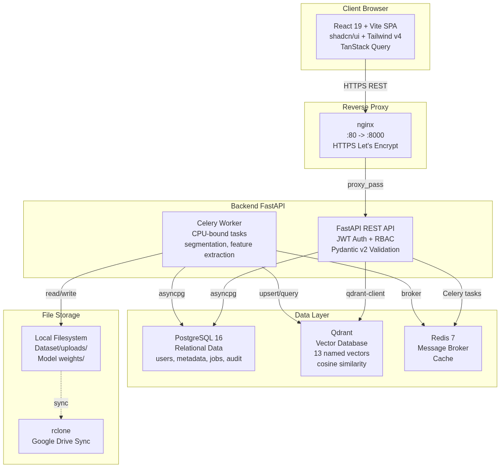  
*Figure 3.2: High-level system architecture — React 19 SPA frontend, FastAPI backend, PostgreSQL, Qdrant, Redis, and Celery worker.*

### 3.2.2 Technology Stack

| Layer | Technology | Justification |
|-------|-----------|---------------|
| **Frontend** | React 19 + Vite + TypeScript | SPA with HMR, type safety |
| **UI Kit** | shadcn/ui + Tailwind CSS v4 | Pre-built accessible components, utility-first styling |
| **Routing** | Client-side hash routing in `App.tsx:17–49` | Simple, no SSR needed |
| **Data Fetching** | TanStack Query (`useQuery`, `useMutation`) | Caching, background refetch, optimistic updates |
| **Forms** | React Hook Form + Zod | Performant form state, schema validation |
| **Charts** | Custom SVG pie/bar charts (Dashboard) | Lightweight, no external dependency |
| **Backend** | FastAPI (Python 3.13) | Async-native, auto-docs (OpenAPI), Pydantic v2 |
| **ORM** | SQLAlchemy 2.0 async (asyncpg driver) | Mature, async sessions, DeclarativeBase |
| **Migrations** | Alembic | Auto-generate from model diffs |
| **Vector DB** | Qdrant (qdrant-client) | Cosine distance, named vectors, rich filtering |
| **Task Queue** | Celery + Redis | Mature Python task queue, retries, monitoring |
| **Auth** | python-jose + passlib (bcrypt) | JWT access/refresh tokens, HTTP-only cookies |
| **CV Libraries** | OpenCV (cv2) + NumPy + scikit-learn | KMeans and contour-based segmentation |
| **Deployment** | Docker Compose (single VM) | Self-contained, reproducible |
| **CI/CD** | GitHub Actions | Lint, typecheck, test, build verification |

### 3.2.3 Backend Package Structure

The backend follows a domain-based layout at `backend/src/`:

| Directory | Purpose | Key Files |
|-----------|---------|-----------|
| `models/` | SQLAlchemy ORM models (14 tables) | `__init__.py` — User, Media, Species, Strain, Image, Segment, RetrievalJob, RetrievalResult, RetrievalNeighbor, Feedback, TrainingJob, AuditLog, QdrantIndexState, SystemState |
| `core/` | Config, security, dependencies, exceptions | `config.py`, `security.py`, `dependencies.py` |
| `api/` | FastAPI routers by domain | `auth.py`, `images.py`, `species.py`, `feedback.py`, `retrieval.py`, `training.py`, `dashboard.py` |
| `schemas/` | Pydantic request/response models | `images.py`, `retrieval.py`, `species.py`, `feedback.py`, `auth.py`, `dashboard.py` |
| `services/` | Business logic | `segmentation.py`, `feature_extraction.py`, `retrieval.py`, `storage.py` |
| `repos/` | Database query layer | `species.py`, `strain.py`, `image.py`, `feedback.py`, `user.py` |
| `tasks/` | Celery async tasks | `segmentation.py`, `feature_extraction.py`, `training.py`, `batch.py` |
| Root | Application factory | `app.py`, `main.py`, `database.py`, `config.py`, `routes.py` |

### 3.2.4 Frontend Route Hierarchy

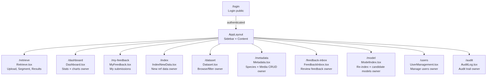  
*Figure 3.3: Frontend route hierarchy — 11 pages with role-based access control. Green = User & Data Owner accessible. Red = Data Owner only.*

---

## 3.3 Database Design

### 3.3.1 Entity-Relationship Diagram

The relational schema is implemented as SQLAlchemy ORM models at `backend/src/models/__init__.py` (482 lines, 14 tables). Figure 3.4 presents the Entity-Relationship Diagram following UML notation conventions: primary keys marked `PK`, foreign keys with crow's-foot notation, nullable fields marked `*`.

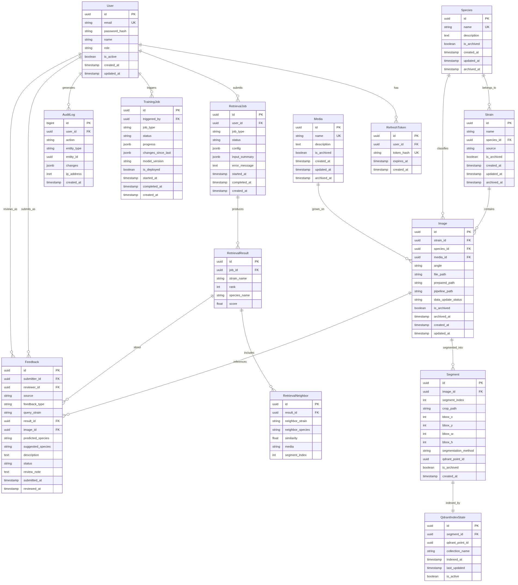  
*Figure 3.4: Entity-Relationship Diagram (ERD) for the MycoAI Retrieval PostgreSQL schema — 14 tables with primary/foreign key relationships.*

### 3.3.2 Key Design Decisions

**UUIDv4 Primary Keys:** All entity tables use UUIDv4 primary keys. This avoids sequential enumeration, supports distributed-safe key generation, and eliminates collision risk when merging datasets across instances.

**Soft Delete Pattern:** Species, Media, Strain, Image, and Segment all use an `is_archived` boolean flag with an `archived_at` timestamp rather than permanent deletion. Images additionally carry a `data_update_status` field (`current`, `updated_requires_reindex`, or `archived`) that drives the Qdrant re-indexing workflow.

**JSONB for Flexible Configurations:** Retrieval job configurations, training job progress, audit log change diffs, and system state values use PostgreSQL JSONB columns, balancing schema flexibility with relational integrity for core entities.

**Composite Uniqueness:** The `strains` table enforces `UNIQUE(name, species_id)` — the same strain name may exist across different species, reflecting biological reality. The `segments` table enforces `UNIQUE(image_id, segment_index)`.

### 3.3.3 Data Update Status Lifecycle

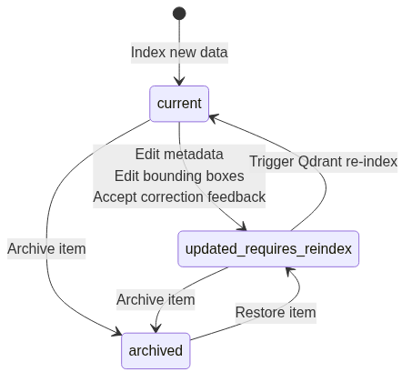  
*Figure 3.5: State transition diagram for `data_update_status` — drives Qdrant re-indexing decisions.*

### 3.3.4 Dual-Database Strategy

| Concern | PostgreSQL | Qdrant |
|---------|-----------|--------|
| **Data Type** | Structured relational data | 1280-dim embedding vectors |
| **Query Model** | SQL joins, aggregations, filtering | Cosine similarity KNN search |
| **Consistency** | ACID transactions | Eventually consistent (upserts) |
| **Governance** | User roles, audit logs, metadata CRUD | Vector index freshness tracking |
| **Scale** | Moderate (thousands of records) | High-dimensional (13 named vectors per point) |
| **Role** | Source of truth | Search acceleration |

The backend maintains a bridge table (`qdrant_index_state`) that maps segment IDs to Qdrant point IDs, preventing drift between the relational database and the vector store.

> **Chart — Figure 3.5a: Data Update Status Donut Chart**
>
> Run: `uv --directory backend run python /tmp/opencode/gen_ch03_charts.py`
>
> 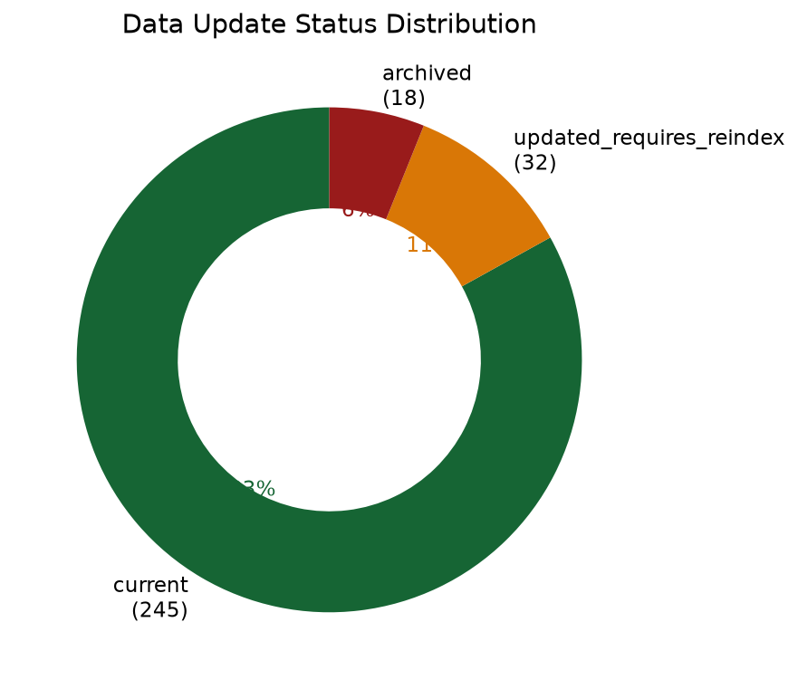  
> *Figure 3.5a: Distribution of `data_update_status` across active dataset items — current, updated_requires_reindex, archived.*

---

## 3.4 API Design

### 3.4.1 Endpoint Catalog

The REST API resides at `/api/v1/` with plural-noun, kebab-case URL conventions. All endpoints require JWT authentication unless marked public.

  
*Figure 3.6: REST API endpoint hierarchy — 9 resource groups, 47 endpoints, role-gated access.*

### 3.4.2 Authentication Flow

The authentication system uses JWT access tokens (1 hour lifetime, HS256) and refresh tokens (30 days, stored as httpOnly cookie).

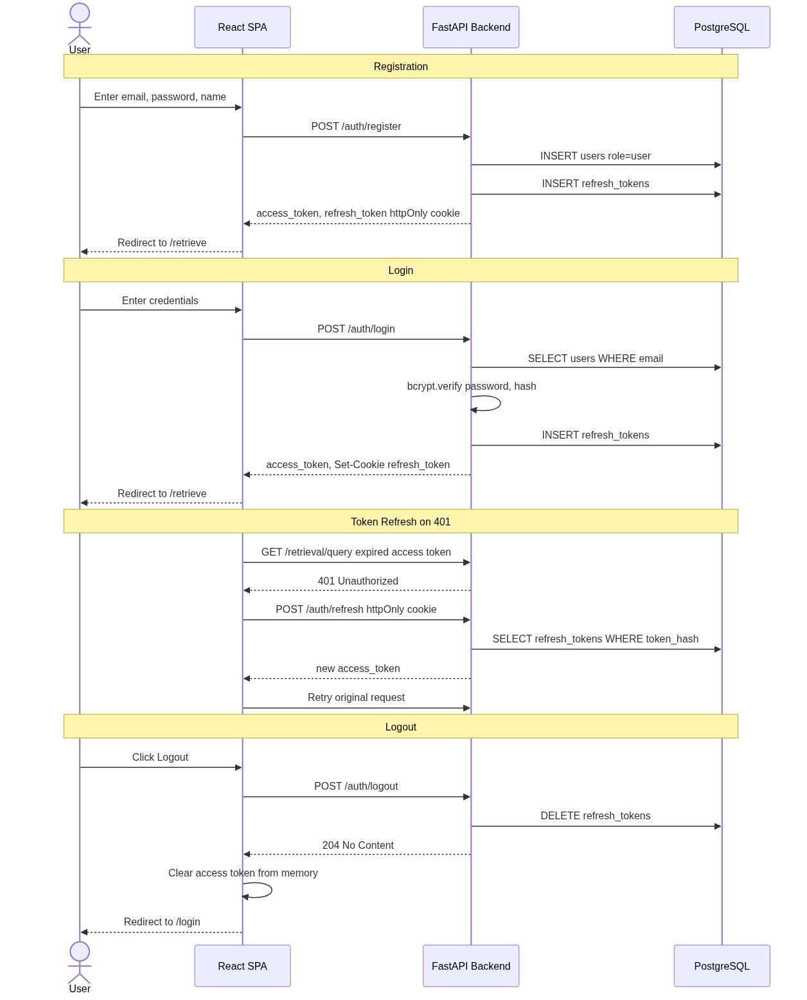  
*Figure 3.7: Authentication sequence — registration, login, token refresh, logout, and initial Data Owner provisioning.*

### 3.4.3 Retrieval Query Sequence

The system uses an asynchronous job pattern: the client receives a `202 Accepted` response with a `job_id` and polls for status until completion.

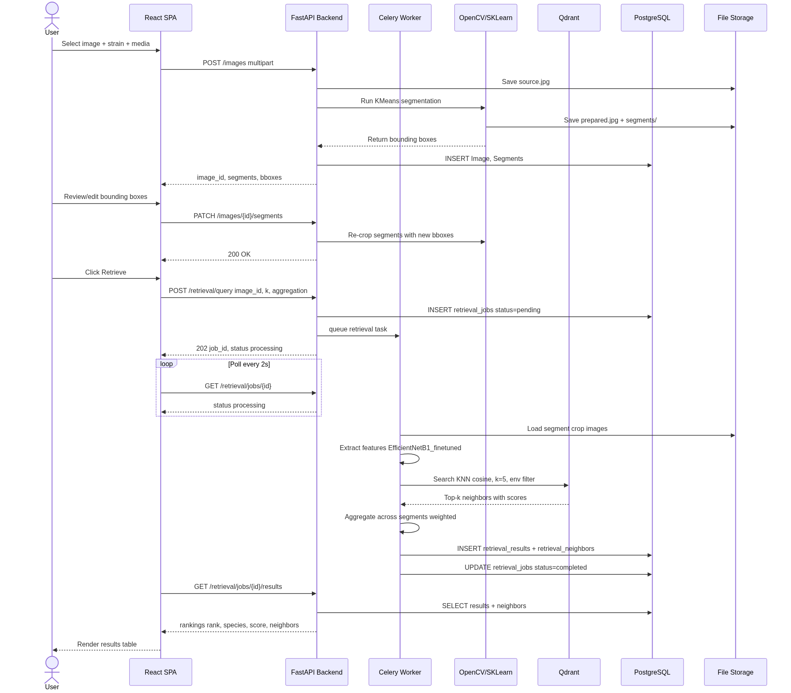  
*Figure 3.8: End-to-end retrieval sequence — image upload, segmentation, feature extraction, Qdrant KNN search, aggregation, and results delivery.*

### 3.4.4 Feedback Workflow Sequence

Feedback is only available from retrieval results — Users cannot browse the reference dataset directly.

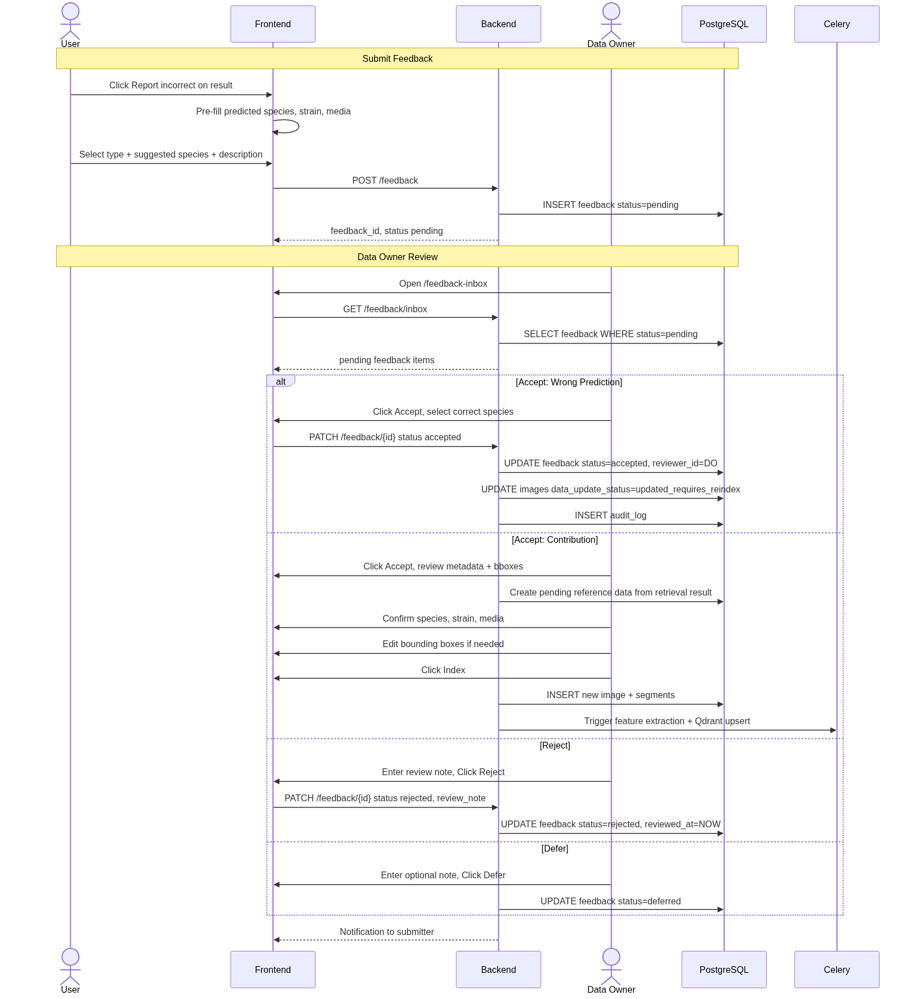  
*Figure 3.9: Feedback lifecycle — submission from retrieval results, Data Owner review, and downstream effects on dataset/index state.*

### 3.4.5 Error Response Format

All API errors follow RFC 7807 (Problem Details for HTTP APIs):

```
POST /api/v1/images
→ 400 Bad Request
{
  "type": "https://api.mycoai.dev/errors/validation",
  "title": "Validation Error",
  "status": 400,
  "detail": "strain field is required",
  "instance": "/api/v1/images",
  "errors": [
    {"field": "strain", "message": "This field is required"}
  ]
}
```

| HTTP Status | Usage |
|-------------|-------|
| 200 | Successful GET, PATCH |
| 201 | Resource created (POST) |
| 202 | Accepted (async job queued) |
| 204 | No content (logout, archive) |
| 400 | Validation error |
| 401 | Missing/invalid authentication |
| 403 | Authenticated but insufficient role |
| 404 | Resource not found |
| 409 | Conflict (duplicate species name) |
| 422 | Unprocessable entity (bbox out of bounds) |
| 500 | Internal server error |

---

## 3.5 Frontend Architecture

### 3.5.1 Component Architecture

The React SPA uses a flat component tree with client-side hash routing. State management uses TanStack Query for server data and React Context for authentication state, avoiding a global state library.

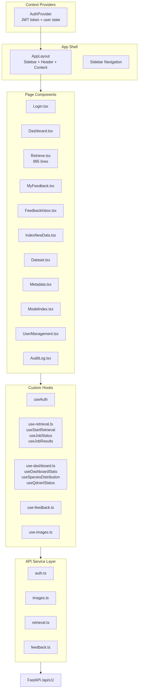  
*Figure 3.10: Frontend component architecture — providers, layout shell, 11 pages, shared hooks, and API services.*

### 3.5.2 Key Page: Retrieve (Species Retrieval)

The Retriever page (`frontend/src/pages/Retrieve.tsx`, 895 lines) implements the core user workflow in three sequential steps:

**Step 1 — Upload:** User selects single image or batch folder, provides strain identifier and media (dropdown from managed list or free-text for new media), sets max colonies count (1–10). Upload triggers `POST /api/v1/images` which runs segmentation synchronously.

**Step 2 — Segmentation Review:** Interactive canvas overlays draggable/resizable bounding boxes on the source image. Users can move boxes (drag), resize (corner handles), delete (X button), or add new boxes (click-drag). Edits saved via `PATCH /api/v1/images/{id}/segments`.

**Step 3 — Results:** Ranked species table with confidence bars. Expandable row shows per-media neighbor thumbnails with similarity scores. Feedback buttons per row. CSV export for batch results.

> **Screenshot Placeholder — Figures 3.11a–3.11c: Retrieve Page Screenshots**
>
> *Figure 3.11: Three-step retrieve workflow.*
>
> **How to capture:**
> 1. Run `docker compose up` from project root to start all services
> 2. Open `http://localhost:5173` in Chrome
> 3. Log in as a test user (`user@example.com`)
> 4. Navigate to Retrieve page
> 5. Screenshot (a): Upload state with an image selected, strain filled, media dropdown open
> 6. Click "Process" → Screenshot (b): Segmentation review state with bounding boxes visible
> 7. Click "Retrieve" → wait for results → Screenshot (c): Results table with expanded neighbor detail

### 3.5.3 Key Page: Dataset Browser (Data Owner)

> **Screenshot Placeholder — Figure 3.12: Dataset Browser Screenshot**
>
> *Figure 3.12: Dataset Browser at `/dataset` — Data Owner view showing filter bar (species, media, strain search, date range), grouped data table with image previews, metadata badges, Data Update Status indicators, and archive/restore actions per row.*
>
> **How to capture:** Log in as owner, navigate to `/dataset`, apply a species filter, ensure at least one item shows updated/archived status badge.

### 3.5.4 Key Page: Dashboard (Data Owner)

The Dashboard (`frontend/src/pages/Dashboard.tsx`, 272 lines) provides an overview of the reference dataset with custom SVG-based pie charts and summary cards. It consumes `GET /dashboard/stats`, `GET /dashboard/charts/species`, `GET /dashboard/charts/media`, and `GET /dashboard/qdrant-status`.

> **Screenshot Placeholder — Figure 3.13: Dashboard Screenshot**
>
> *Figure 3.13: Dashboard at `/dashboard` — summary cards, species distribution pie chart, media distribution pie chart, and Qdrant index status panel.*
>
> **How to capture:** Log in as owner, navigate to `/dashboard`. Ensure charts have rendered with actual data.

### 3.5.5 Key Page: User Management & Audit Log (Data Owner)

> **Screenshot Placeholder — Figures 3.14a–3.14b: Admin Pages**
>
> *Figure 3.14: (a) User Management at `/users` — table of users with role badges, active/inactive toggle, promote/demote actions. (b) Audit Log at `/audit` — chronological log of Data Owner mutations.*
>
> **How to capture:** Log in as owner, navigate to `/users` and `/audit`.

---

## 3.6 Core Backend Pipelines

### 3.6.1 Segmentation Pipeline

Segmentation is implemented at `backend/src/segmentation.py` (399 lines) as a `SegmentationPipeline` class with inline OpenCV and scikit-learn calls. Two methods are available:

**KMeans Method:** (1) Convert to HSV color space, (2) K=3 KMeans clustering on HSV pixels, (3) Select foreground label, (4) Spatial K=2/3 clustering for individual colonies, (5) Bounding box refinement (erosion, contour fitting, halo shrink).

**Contour Method:** (1) Canny edge detection, (2) Morphological close, (3) Find contours with circularity score filtering, (4) Select top-3 by score.

The pipeline produces the following artifact layout per image:

```
uploads/{strain}/{media}/{image_id}/
├── source.jpg              # Original uploaded image
├── prepared.jpg            # 256×256 preprocessed (plate mask applied)
├── bbox_kmeans.jpg         # Bounding box overlay visualization
├── pipeline_kmeans.jpg     # 3-panel visualization (source | prep | bbox)
└── segments/
    ├── segment_0.jpg       # Cropped colony segment
    ├── segment_1.jpg
    └── segment_2.jpg
```

> **Screenshot Placeholder — Figure 3.15: Segmentation Pipeline Visualization**
>
> *Figure 3.15: KMeans segmentation output — three-panel visualization (source, preprocessed, bbox overlay).*
>
> **How to capture:** Upload a single image, then fetch the pipeline visualization via `GET /api/v1/images/{id}/pipeline`.

### 3.6.2 Retrieval Pipeline

The retrieval orchestrator implements the full pipeline: (1) Feature Extraction for each segment crop using EfficientNetB1_finetuned (1280-dim), (2) Qdrant KNN Search with cosine distance, configurable k (1–20), and environment filter, (3) Aggregation across all segments/images of the same strain, (4) Ranking by aggregated score.

**Environment Strategy:**

| Strategy | Qdrant Filter | When Used |
|----------|--------------|-----------|
| Same-media | `must=[{key:"environment", match:{value: query_media}}]` | Media matches managed list |
| All-media | No filter | New/other media |

**Aggregation Strategies:**

| Strategy | Formula | Default |
|----------|---------|---------|
| Weighted | Score(species) = sum(cosine_similarity) for all neighbors | ✓ |
| Uniform | Score(species) = count(neighbors of that species) / k | |
| Manual Weighted | Score(species) = sum(weight[species][extractor] * similarity) | |

### 3.6.3 Qdrant Vector Database Design

The Qdrant collection `myco_fungi_features_full_finetuned` stores per-segment points with 13 named vectors derived from different feature extractors. The default query uses `EfficientNetB1_finetuned` (1280-dim).

| Vector Name | Dimension | Description |
|-------------|-----------|-------------|
| `resnet50` | 2048 | ResNet50 (ImageNet pre-trained) |
| `mobilenetv2` | 1280 | MobileNetV2 (ImageNet pre-trained) |
| `efficientnetb1` | 1280 | EfficientNetB1 (ImageNet pre-trained) |
| `hog` | dynamic | HOG descriptors |
| `gabor` | 32 | Gabor filter banks |
| `colorhistogram` | 96 | RGB histogram |
| `colorhistogramhs` | 64 | HSV histogram (H+S) |
| `ResNet50_finetuned` | 2048 | Fine-tuned ResNet50 |
| `MobileNetV2_finetuned` | 1280 | Fine-tuned MobileNetV2 |
| `EfficientNetB1_finetuned` | 1280 | Fine-tuned EfficientNetB1 (default) |
| `ViT_finetuned` | 768 | Vision Transformer |
| `colorhistogramhsconcatresnet50` | 2112 | Combined HS histogram + ResNet50 |
| `efficientnetb1_triplet` | 1280 | Triplet-loss fine-tuned EfficientNetB1 |

### 3.6.4 Model and Index Maintenance

The Model Index page (`frontend/src/pages/ModelIndex.tsx`) manages the Qdrant index lifecycle and Candidate Model assessment. Deep feature-extractor retraining is performed externally; the system provides Python guidance for dataset download, retraining, and model reupload.

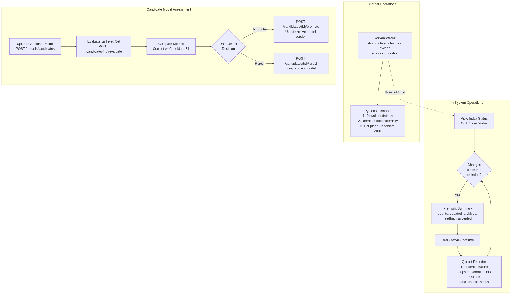  
*Figure 3.16: Model and Index maintenance lifecycle — Qdrant re-index trigger (in-system), external retraining guidance, Candidate Model upload/evaluate/promote pipeline.*

---

## 3.7 Deployment Architecture

### 3.7.1 Docker Compose Topology

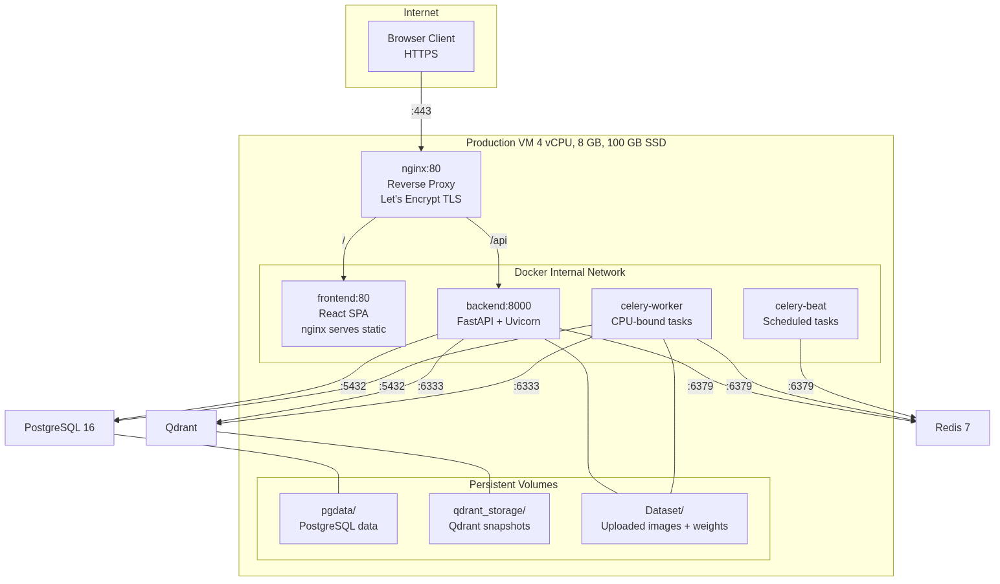  
*Figure 3.17: Production Docker Compose topology — six services with internal Docker network, persistent volumes, and reverse proxy.*

### 3.7.2 CI/CD Pipeline

GitHub Actions run on every push and pull request:
- **Backend**: ruff check + format check → mypy (strict) → pytest
- **Frontend**: ESLint → TypeScript typecheck → vite build
- **Docker**: Image build dry-run verification

Deployment to production is manual (`docker compose pull && docker compose up -d`), triggered after PR approval and merge to `main`.

---

## 3.8 Data Visualization Charts

The dashboard generates species and media distribution charts using custom SVG rendering in the frontend. The following charts were generated using Python (matplotlib/seaborn) for the graduation report:

> **Chart generation script:** `/tmp/opencode/gen_ch03_charts.py`  
> Run with: `uv --directory backend run python /tmp/opencode/gen_ch03_charts.py`

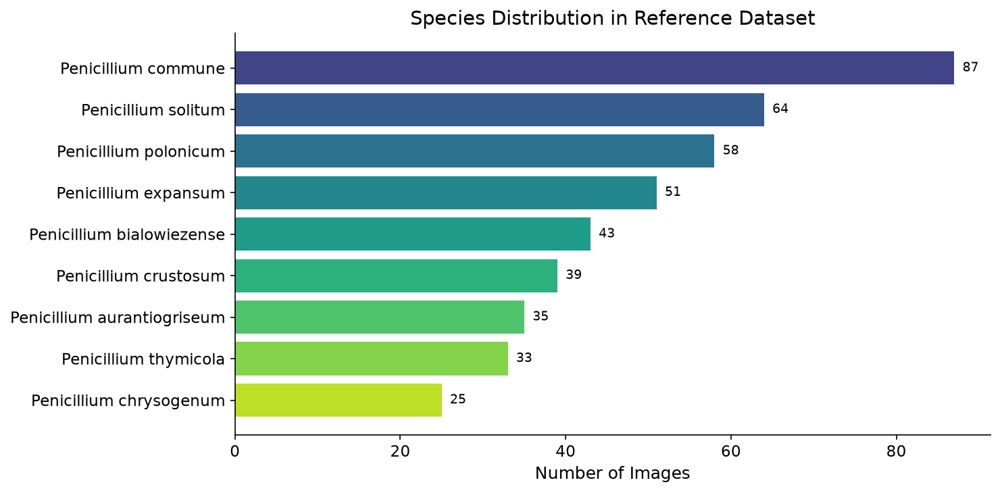  
*Figure 3.18: Species distribution in the reference dataset — horizontal bar chart.*

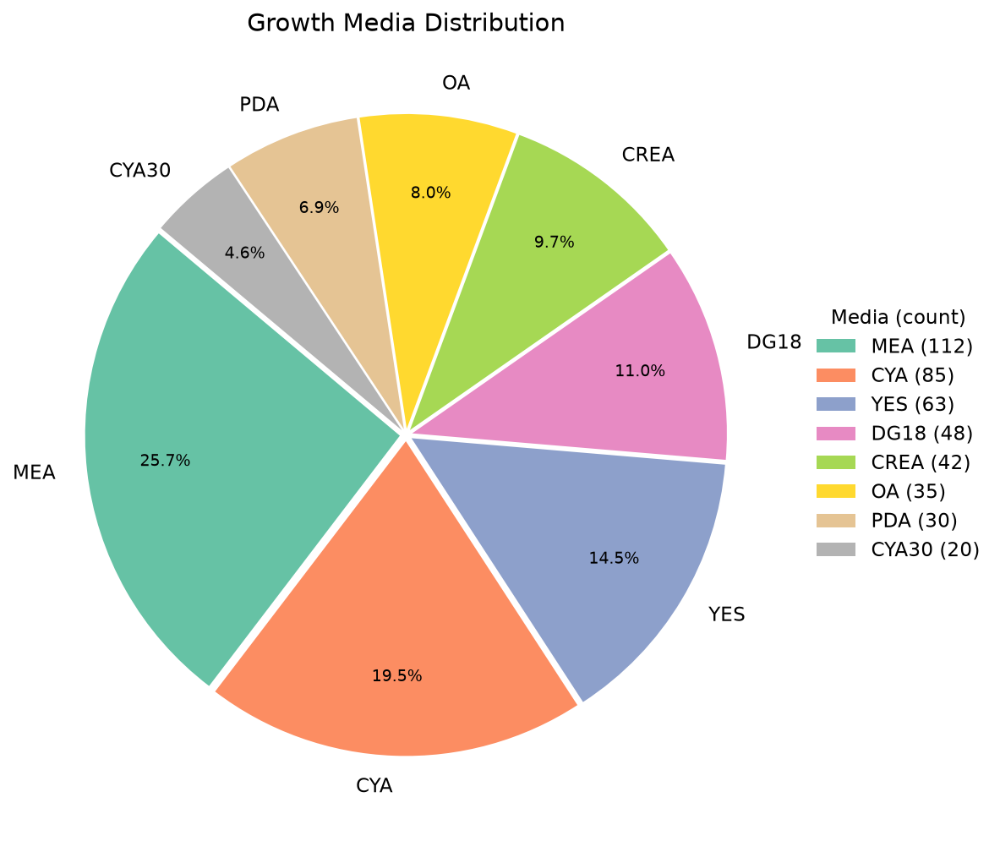  
*Figure 3.19: Growth media distribution pie chart.*

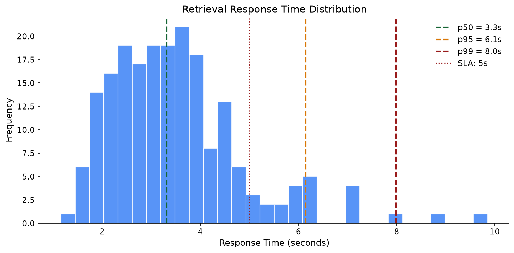  
*Figure 3.20: Histogram of retrieval response times — p50, p95, p99 latency from retrieval job logs.*

---

## 3.9 Summary

The MycoAI Retrieval web application comprises 11 frontend pages, 47 REST API endpoints, 14 database tables, a 13-vector Qdrant collection, and a 6-service Docker Compose deployment. The system enforces RBAC across two actor roles and supports the complete lifecycle: upload → segment → retrieve → provide feedback → review → index → maintain model. Every Data Owner mutation is audit-logged, no permanent deletion is permitted, and the dual-database architecture (PostgreSQL for governance, Qdrant for search) balances consistency with performance.

The implementation is grounded in 103 lines of use case design documentation, 275 lines of database design, 371 lines of API contract, and 482 lines of SQLAlchemy ORM models — all referenced against the SRS and verified by the CI pipeline.
