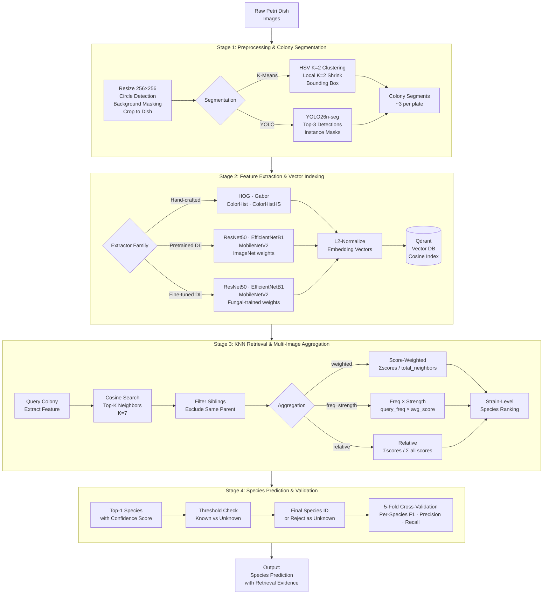

# Fungal Species Retrieval Pipeline

## Pipeline Stages — Detailed Breakdown

### Stage 1: Preprocessing & Colony Segmentation

**Input:** Raw Petri dish microscopy images (435 curated + 460 incoming, 8 Penicillium species)

1. **Dish Detection & Crop:** Hough Circle Transform detects dish boundary → background masked → cropped to dish region.
2. **Resize:** Standardized to 256×256 pixels.
3. **Colony Segmentation (two methods):**
   - **K-Means (primary):** HSV color-space K=2 clustering separates colony foreground from agar background. Local K=2 Shrink mitigates agar flare on MEA/YES media by re-clustering per-colony regions and eroding halo pixels.
   - **YOLO26n-seg (alternative):** Fine-tuned instance segmentation model trained on 303 labeled colony images, producing polygon masks with confidence ≥ 0.15.
4. **Output:** ~3 colony segment crops per dish (typically 9 segments per strain: 3 colonies × 3 media conditions).

### Stage 2: Feature Extraction & Vector Indexing

**Input:** Segmented colony images (256×256×3 RGB)

1. **Feature Extractors (3 families):**
   - **Hand-crafted (TR):** HOG (3,780-dim gradient orientation), Gabor (40-dim texture), ColorHistogram (96-dim RGB), ColorHistogramHS (64-dim Hue+Saturation).
   - **Pretrained Deep Learning (PT):** ResNet50, EfficientNetB1, MobileNetV2 with ImageNet-1K weights — backbone only, classifier removed, output pooled features (1,280–2,048-dim).
   - **Fine-tuned Deep Learning (FT):** Same architectures fine-tuned on 1,011 fungal colony images (8 species, 24 strains) via cross-entropy classification proxy task.
2. **L2 Normalization:** All vectors normalized to unit length for cosine similarity comparison.
3. **Vector Database:** Points indexed in Qdrant with multi-vector support (each extractor produces a named vector). Payload includes strain ID, species label, growth medium, camera angle, segment index. Collection: `myco_fungi_features_full`.

### Stage 3: KNN Retrieval & Multi-Image Aggregation

**Input:** Query colony image → feature vector v_q

1. **Cosine Nearest Neighbor Search:** Top-K neighbors retrieved from Qdrant (K=7). Query strain's own vectors excluded.
2. **Sibling Filtering:** Neighbors from the same parent Petri dish image as the query segment are removed to prevent data leakage.
3. **Multi-Image Aggregation (3 strategies):**
   - **weighted:** `scores[X] / total_neighbors` — fraction of total similarity mass belonging to species X.
   - **freq_strength:** `(queries_with_X / M) × (scores[X] / count[X])` — how often X appears × average match strength.
   - **relative:** `scores[X] / Σ all_scores` — share of total evidence, naturally summing to 1.
4. **Output:** Sorted species ranking with confidence scores.

### Stage 4: Species Prediction & Validation

**Input:** Aggregated species scores per test strain

1. **Top-1 Prediction:** Highest-scoring species selected as prediction.
2. **Threshold Classification:** Formula applied to top-K scores determines known vs unknown — thresholds optimized via F1-grid search, ROC Youden's J, or Otsu's method.
3. **5-Fold Cross-Validation:** Strain-level stratified folds, 45 evaluation configurations (3 aggregations × 3 K values × 5 folds). Metrics: per-species accuracy, F1, precision, recall.
4. **Output:** Final species prediction with retrieval evidence visualization (query + top neighbors).
