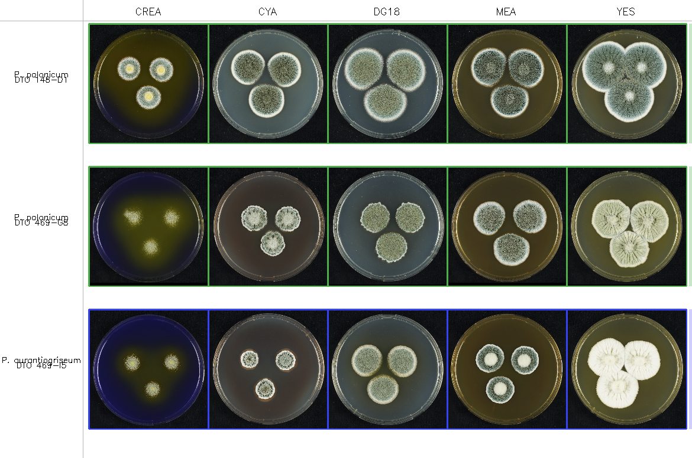
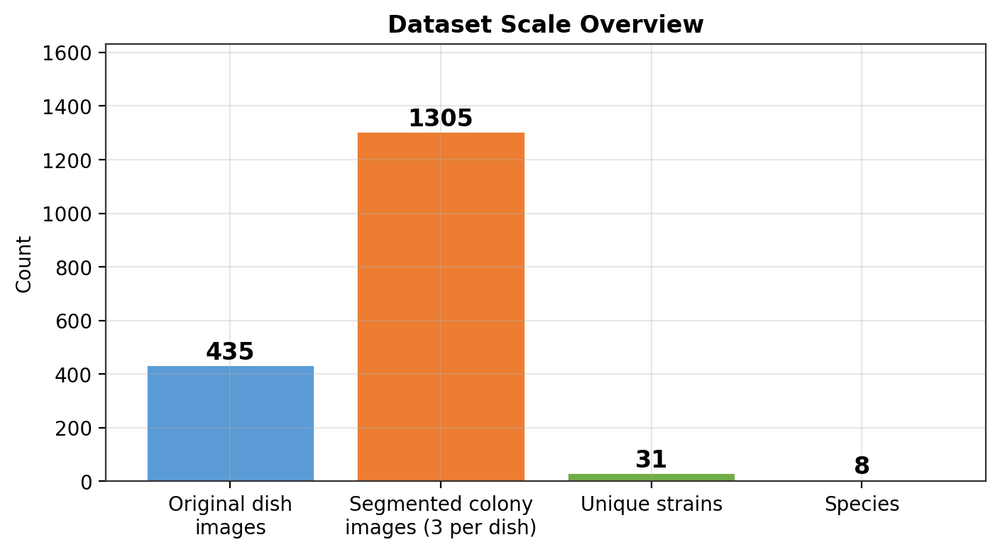
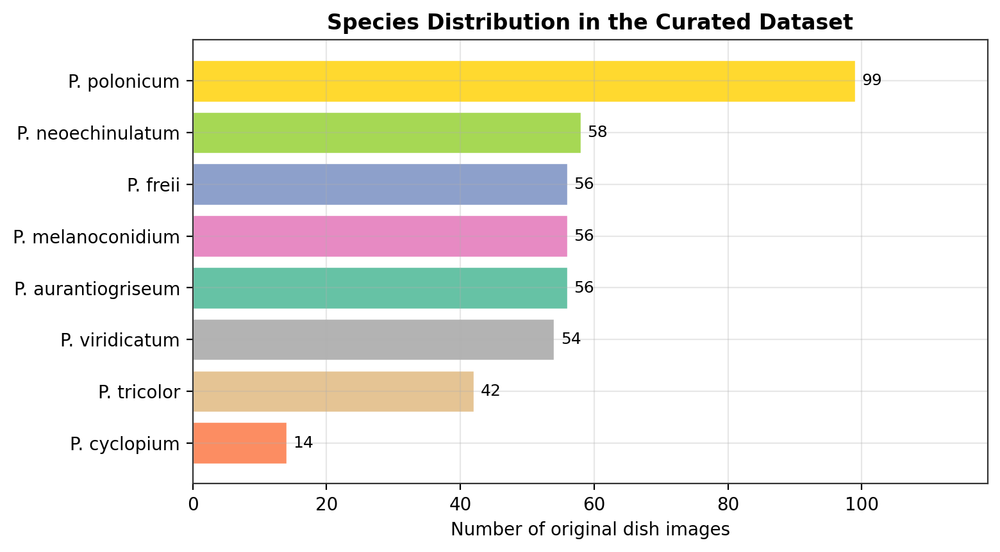
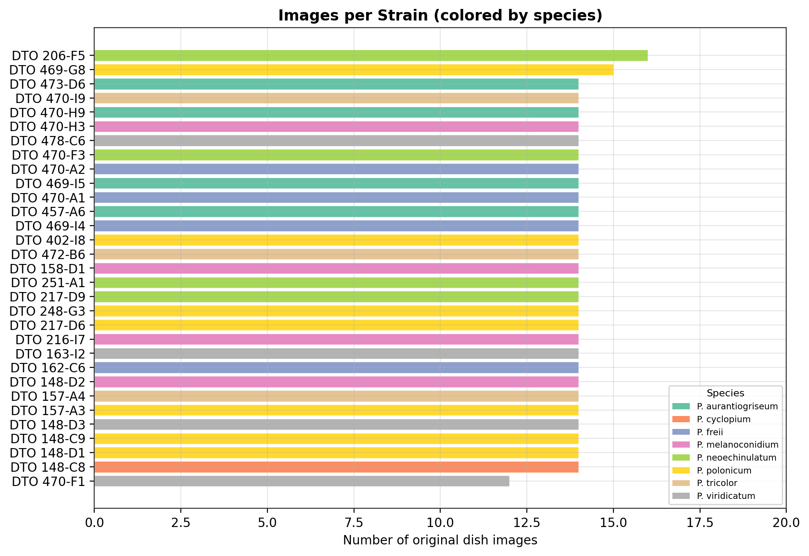
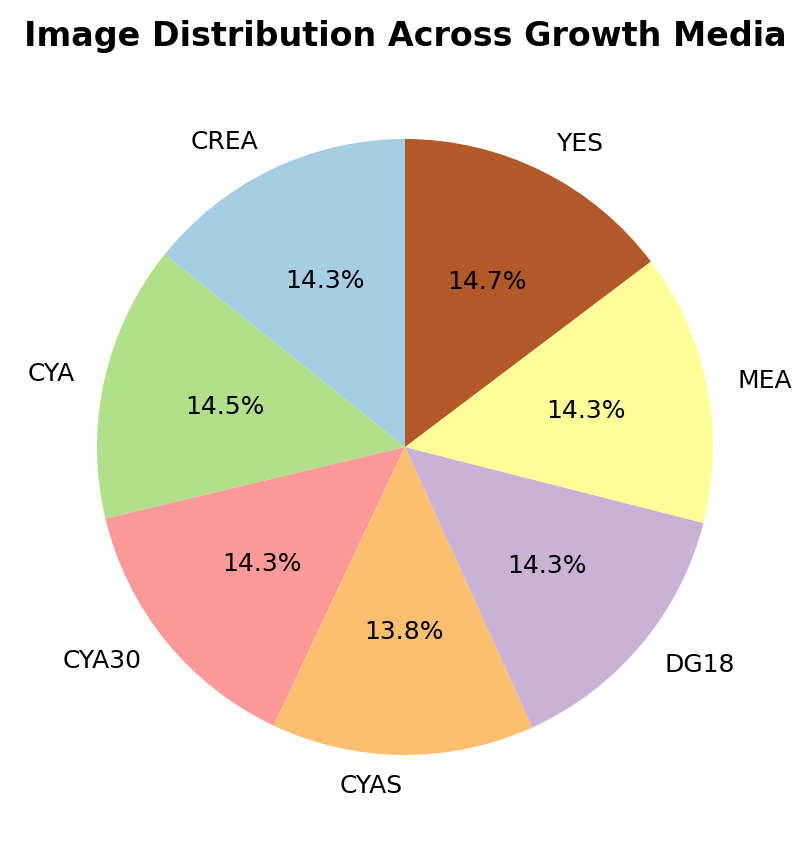
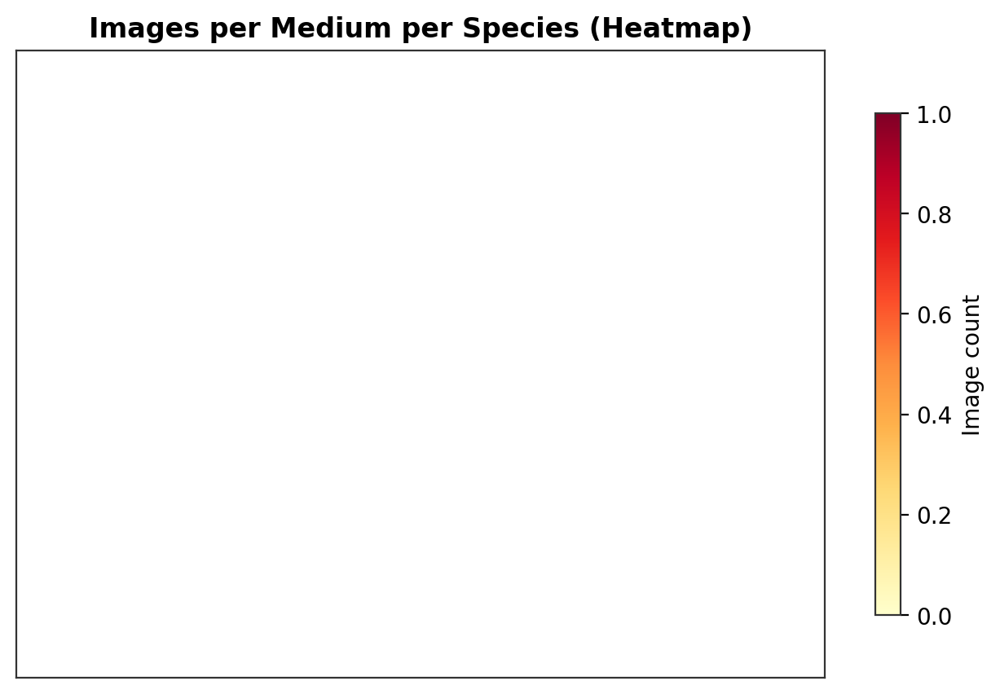
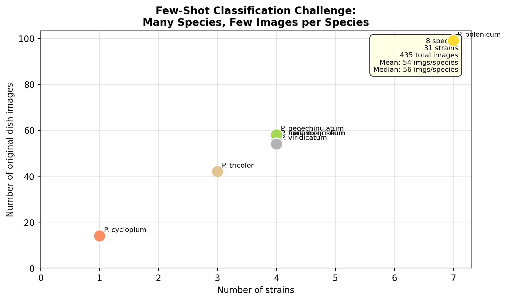

# Chapter 1: Problem Statement

## 1.1 Overview

Accurate identification of fungal species is a fundamental task in mycology, with direct implications for food safety, pharmaceutical quality control, and clinical diagnostics. Traditionally, this task relies on expert mycologists who examine colony morphology—color, texture, growth pattern, and pigmentation—across multiple growth media. This manual process is time-consuming, requires years of specialized training, and introduces inter-observer variability. As fungal taxonomy expands and laboratories handle increasing sample volumes, scalable automated approaches become essential.

This thesis addresses the challenge through **MycoAI Retrieval**, an image-based retrieval system for fungal species identification. Given a photograph of a fungal colony grown on a known medium, the system searches a curated reference database and returns the most visually similar known strains along with their species labels. Rather than attempting to classify every possible fungal species in a closed set, the system uses a similarity-based retrieval approach: it extracts visual features from the query image, compares them against pre-computed features of all reference strains, and aggregates the nearest matches to produce a species-level prediction. This design naturally accommodates new species and strains without retraining, a critical advantage in a domain where novel taxa are continuously discovered.

The system is evaluated on a dataset of *Penicillium* species—a genus of significant industrial and medical importance—and demonstrates that retrieval-based classification with learned visual features can achieve high accuracy even with limited training data per species.

## 1.2 Dataset Description

### 1.2.1 Dataset Structure

The primary dataset consists of 435 high-resolution photographs of fungal colonies cultured on Petri dishes. Each dish contains exactly three circular fungal colonies of the same strain, grown on a single growth medium. Images are captured under a microscope from two viewing angles: **oblique** (`ob`, top-down angled view) and **reverse** (`rev`, view from the bottom of the dish). The oblique angle captures surface morphology—colony color, texture, and sporulation patterns—while the reverse angle reveals pigments diffused into the agar, which are often species-diagnostic. Individual colonies vary in size and texture across species, media, and incubation conditions, which the retrieval system must learn to handle robustly.

The data hierarchy follows the natural biological organization:

```
Species → Strain → Growth Medium → Image (oblique / reverse)
```

- **Species** (8): The taxonomic unit to be predicted. All species belong to the genus *Penicillium*.
- **Strain** (31): A genetically distinct isolate within a species. Each strain is cultured across multiple media.
- **Growth Medium** (7): CREA, CYA, CYA30, CYAS, DG18, MEA, and YES. Different media induce different colony morphologies, and comparing across media is essential for accurate identification.
- **Angle** (2): Oblique (`ob`) and reverse (`rev`), providing complementary visual information.
- **Colonies per dish** (3): Each dish contains three colonies, which are later segmented into individual images.

Figure 1.1 illustrates the dataset's multi-dimensional nature: three strains grown on five representative media, all shown from the oblique angle. The first two rows are strains of the same species (*P. polonicum*), demonstrating within-species morphological variation across both strains and media. The third row is a different species (*P. aurantiogriseum*), showing the between-species differences that the retrieval system must learn to detect.


*Figure 1.1: Three fungal strains across five growth media (oblique view). Rows 1–2: two strains of P. polonicum (same species). Row 3: P. aurantiogriseum (different species). Green border = same species as reference; red border = different species.*

### 1.2.2 Exploratory Data Analysis

To understand the dataset's composition and identify challenges for machine learning, we performed an exploratory data analysis with the following findings.

**Dataset scale.** Figure 1.2 summarizes the overall scale: 435 original dish images are segmented into 1,305 individual colony images (3 colonies per dish). The dataset spans 31 strains across 8 species, with all 435 images successfully parsed and labeled.


*Figure 1.2: Dataset scale overview showing the relationship between original images, segmented colonies, strains, and species.*

**Species distribution.** Figure 1.3 shows the number of original dish images per species. The dataset is **class-imbalanced**: *P. polonicum* contributes 99 images (22.8% of the total), while *P. cyclopium* contributes only 14 images (3.2%). This imbalance reflects real-world collection constraints—some species are more frequently isolated than others—but it creates challenges for supervised learning, as minority classes have insufficient examples for training robust classifiers.


*Figure 1.3: Number of original dish images per species in the curated dataset.*

**Strain-level distribution.** Figure 1.4 breaks down the data at the strain level, colored by species. Most strains have exactly 14 images (7 media × 2 angles), with minor variations due to contaminated samples or missing captures. The per-strain consistency is a deliberate experimental design choice, ensuring that each strain contributes comparable evidence for both reference indexing and evaluation.


*Figure 1.4: Images per strain, colored by species. Most strains contribute 14 images (7 media × 2 angles).*

**Growth media coverage.** Figure 1.5 shows that images are evenly distributed across the seven growth media, with each medium contributing between 60 and 64 images. This balanced coverage is important because colony appearance can vary dramatically across media—a species that looks distinctive on CYA may appear nearly identical to another species on DG18. The system must learn features that are robust to these media-induced variations.


*Figure 1.5: Distribution of images across seven growth media.*

**Media × species interaction.** Figure 1.6 provides a heatmap of image counts per species per medium. The near-uniform cell values confirm that the dataset is well-balanced across media for most species. *P. polonicum* has slightly more images per medium due to having more strains. This balanced design means that species-level evaluation is not confounded by unequal media representation.


*Figure 1.6: Heatmap showing the number of images per species per growth medium.*

### 1.2.3 The Few-Shot Classification Challenge

The dataset's most critical characteristic is the mismatch between the number of classes and the number of examples per class. Figure 1.7 visualizes this: 8 species distributed across only 31 strains, with a mean of 54 images per species and a median of 56.


*Figure 1.7: Few-shot classification challenge. Each point represents one species, positioned by its number of strains (x-axis) and number of images (y-axis).*

This places the problem squarely in the **few-shot classification** regime~[Sung et al., 2018; Snell et al., 2017]. Traditional deep learning classifiers—such as a standard CNN with a softmax output layer—typically require hundreds to thousands of examples per class to generalize reliably. With only 14–99 original images per species (and 42–297 segmented colonies), training a conventional classifier from scratch on this dataset would lead to severe overfitting. Transfer learning from models pre-trained on large natural-image datasets (e.g., ImageNet) partially mitigates this, but the domain gap between natural images and fungal colony microscopy remains substantial~[Zieliński et al., 2020].

The few-shot challenge is compounded by **strain-level evaluation**: the test set consists of entirely held-out strains (7 strains, one per species except *P. cyclopium*, which lacks a test strain). This means the model must generalize not just to new images of seen strains, but to genetically distinct isolates that may exhibit different morphological characteristics even within the same species. A strain-level split is significantly more demanding than a random image-level split, and it reflects the true deployment scenario where a user submits a sample from a previously unseen strain.

These constraints motivate the choice of a **retrieval-based approach** over a fixed classifier, as elaborated in Section 1.5.

## 1.3 Scope of Work

The scope of this thesis encompasses three interconnected domains:

1. **Algorithmic Research**: Design and optimization of a retrieval pipeline for fungal species identification. This includes colony segmentation from Petri dish images, feature extraction using both hand-crafted descriptors and fine-tuned deep learning models, vector indexing and similarity search, and a weighted aggregation strategy for converting segment-level retrieval results into strain-level species predictions. The research also investigates the effect of growth medium selection and cross-validation strategies on retrieval accuracy.

2. **System Engineering**: Implementation of a production-oriented web application that wraps the retrieval pipeline behind a user interface. This includes authenticated access for researchers, a species catalog management interface, real-time image upload with retrieval feedback, and visualization of prediction results showing the query image alongside its nearest reference neighbors.

3. **Process Innovation**: Application of an agentic engineering methodology to the research workflow. A multi-agent system autonomously proposes experimental hypotheses, executes evaluation runs, and surfaces the best-performing configurations. Agent details are deferred to Chapter 4.

### 1.3.1 Out of Scope

To maintain focus, the following areas are explicitly excluded from this thesis:

- **De novo species discovery**: The system identifies samples as belonging to known species or rejects them as unknown. It does not propose new taxonomic groupings or discover previously undescribed species.
- **Training of deep learning segmentation models**: The colony segmentation step uses classical computer vision techniques (K-Means clustering and contour detection). Training detection or segmentation models (e.g., YOLO, SAM) for colony extraction is a separate research direction.
- **Mobile or edge deployment**: The system targets server-side deployment. Optimizing models for mobile inference or on-device processing is not addressed.
- **Real-time video classification**: The system processes static images. Video-based colony growth monitoring and temporal analysis are out of scope.
- **Multi-modal fusion with genomic data**: This thesis uses visual features exclusively. Integrating DNA sequence data or metabolomic profiles for hybrid identification is not explored.
- **Growth time metadata**: The current dataset does not include timestamps or growth-stage annotations. Colony morphology evolves over days of incubation, but this temporal dimension is not modeled.
- **Full laboratory information management system (LIMS)**: The web application provides species search and prediction. It is not a complete LIMS with sample tracking, workflow automation, or instrument integration.

- **Multi-tenant and organization-level workspaces**: The system is designed for a single laboratory, as described in the Preface—it addresses the specific requirements of the MycoAI lab and its mycologist collaborators. Multi-tenant architectures (supporting multiple independent labs with separate reference databases, user hierarchies, and access control policies) are explicitly out of scope. Extending the system to an organization-wide platform would require significant architectural changes to the data model, authentication system, and vector database partitioning.

- **Security-focused authentication**: The web application is not evaluated as a security-focused system. Authentication and access control are treated as practical application boundaries for the lab workflow, not as a dedicated security contribution; hardened JWT lifecycle design, adversarial security testing, and production identity-provider integration are out of scope.

- **General onboarding guidance**: The application is intended for a specific laboratory and known mycologist collaborators. Broad onboarding flows, public user education, and generic self-service guidance for unknown organizations are out of scope.

## 1.4 Proposed Solution

The proposed solution is a **retrieval-based classification pipeline** that identifies fungal species by comparing visual features against a pre-indexed reference database. Figure 1.8 illustrates the high-level architecture.


*Figure 1.8: High-level architecture of the retrieval-based classification pipeline. A query image passes through segmentation, feature extraction, vector search, and aggregation stages to produce a species prediction.*

The pipeline operates in two phases:

**Indexing Phase** (offline). All reference strain images are processed through the pipeline: each Petri dish image is segmented into individual colony crops, a feature extractor converts each crop into a high-dimensional vector (embedding), and all embeddings are stored in a vector database along with metadata (strain, species, medium, angle). This phase is performed once and updated incrementally when new reference strains are added.

**Query Phase** (online). When a user submits a new strain for identification:

1. **Segmentation**: The Petri dish image is preprocessed (resized, background-masked via circle detection) and individual colonies are extracted using K-Means clustering. Each dish yields three colony segment images.

2. **Feature Extraction**: Each segment is passed through a feature extractor—a convolutional neural network fine-tuned on the fungal dataset—producing a normalized embedding vector. Multiple complementary extractors can be used; the system supports both hand-crafted descriptors (capturing shape, texture, and color) and deep learning backbones (capturing learned visual features).

3. **Nearest-Neighbor Search**: Each query embedding is compared against the vector database using cosine similarity. The system retrieves the *k* most similar reference segments, excluding any segments belonging to the query strain itself (sibling filtering) to prevent data leakage.

4. **Aggregation**: Since a strain yields multiple query segments (from different media and angles), the per-segment retrieval results are combined using a weighted voting scheme. Each candidate species receives a score proportional to the sum of similarity scores of its retrieved neighbors, normalized by the frequency of appearance. The species with the highest weighted score is the final prediction.

5. **Result Presentation**: The user sees the predicted species, a confidence score, and the top retrieved reference images for visual inspection and validation.

A full treatment of each pipeline stage—including segmentation algorithms, feature extractor architectures, aggregation formulas, and environment selection strategies—is presented in Chapter 2.

### 1.4.1 Why a Retrieval Pipeline?

The choice of a retrieval-based design over a conventional end-to-end classifier is deliberate and driven by the characteristics of the problem:

**Open-set capability.** A classifier with a fixed softmax output can only predict among the species seen during training. Adding a new species requires modifying the architecture and retraining the entire model. In contrast, a retrieval system treats classification as a nearest-neighbor search: adding a new species requires only indexing its reference images into the vector database. No retraining is needed. This is critical in mycology, where the set of known species continuously expands.

**Interpretability.** The system presents the user with the actual reference images that are most similar to the query. A mycologist can visually compare the query colony against its nearest neighbors and assess whether the prediction is plausible. This transparency is valuable in a domain where expert judgment remains the gold standard and erroneous identifications can have consequences.

**Data efficiency.** Retrieval-based classification can perform well with few examples per class because it does not need to learn a decision boundary that separates all classes simultaneously. Instead, it relies on the quality of the feature representation and the assumption that similar images belong to similar species. The feature extractor is trained with a classification objective but deployed as an embedding function, allowing the system to benefit from supervised fine-tuning without being constrained by the number of output classes.

**Graceful degradation.** When the system encounters a species not in the reference database, the retrieval results will show low similarity scores across all known species. This naturally enables an open-set rejection mechanism: if the highest similarity score falls below a learned threshold, the system can report "unknown species" rather than forcing an incorrect classification.

## 1.5 Rationale

### 1.5.1 Retrieval over Fixed Classification

A standard supervised classifier maps an input image directly to a probability distribution over *N* predefined species. This approach has two fundamental limitations for our use case. First, it is **closed-world**: the model cannot express uncertainty about species it was not trained on. Second, it **requires retraining** whenever the species catalog changes, which is impractical in a dynamic research environment.

A retrieval pipeline addresses both issues. The species catalog is decoupled from the model—it lives in the vector database as indexed reference embeddings. Updating the catalog is a database operation, not a machine learning operation. Moreover, retrieval results inherently carry a similarity score, which can be thresholded to implement open-set rejection: if no reference image is sufficiently similar to the query, the system reports "unknown" rather than forcing a potentially incorrect match.

### 1.5.2 Modularity and Versatility

A key architectural advantage of the retrieval pipeline is its **modularity**. Each stage—segmentation, feature extraction, vector search, and aggregation—is an independent component with a well-defined interface. This has several practical benefits:

**Interchangeable feature extractors.** The system can use any feature extractor that produces a fixed-length normalized vector, regardless of whether it is a hand-crafted descriptor (HOG, Gabor filters, color histograms) or a deep learning backbone (ResNet, EfficientNet, Vision Transformer). Different extractors capture different visual properties—texture, shape, color, learned features—and can be combined through late fusion or ensemble voting. When a better feature extractor becomes available, it can replace the existing one without modifying any other component.

**Interchangeable segmentation models.** The segmentation stage is similarly modular. The current system uses K-Means clustering and contour detection, but these can be swapped for deep learning detectors without affecting downstream components. The only contract is that the segmentation stage outputs cropped colony images; how those crops are produced is an implementation detail.

**Experiment-friendly design.** The modular architecture enables systematic experimentation. A researcher can evaluate the effect of a new feature extractor by running the query phase with different extractor configurations while keeping all other components fixed. This makes the system well-suited for the agentic autoresearch workflow described in Chapter 4, where an autonomous agent iteratively tests hypotheses about pipeline configurations and surfaces the best-performing combinations.

**Deployment flexibility.** The separation of feature extraction from vector search means the computationally intensive part (feature extraction) can run on specialized hardware (GPU), while the search and aggregation logic can run on a standard server. The vector database can scale independently to handle growing reference collections.

### 1.5.3 Design Decisions at a Glance

| Decision | Choice | Rationale |
| :--- | :--- | :--- |
| Classification approach | Retrieval-based (KNN) | Open-set capable, no retraining for new species |
| Feature learning | Supervised fine-tuning of pre-trained CNNs | Balances data efficiency with domain adaptation |
| Feature storage | Vector database with cosine similarity | Efficient high-dimensional search with metadata filtering |
| Metadata storage | Relational database | ACID compliance for structured data (users, species catalog, audit trail) |
| Evaluation protocol | Strain-level hold-out | Reflects real deployment: generalization to unseen strains |
| Segmentation | Classical CV (K-Means, contour) | Deterministic, fast, and sufficient for colony extraction from controlled lab images |
| Experiment automation | Multi-agent autoresearch loop | Systematic hypothesis testing with reproducible logging |
