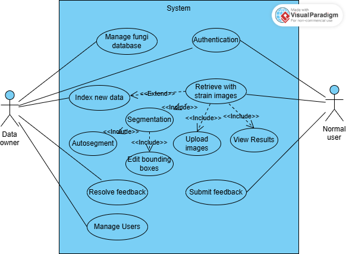

# Technical Spec: Use Case Design

## Overview

The system supports authenticated fungal species retrieval, data-owner data indexing, feedback, database browsing, training observation, and user administration.

## Actors

| Actor | Scope |
|-------|-------|
| Normal User | Authenticated classification, result viewing, and feedback |
| Data Owner | All Normal User use cases plus database, training, and user management |
| AI Segmentation Service | Automatic colony detection for uploaded strain images |
| Retrieval Service | Embedding extraction, vector search, ranking, and result generation |

## Use Cases

### Authentication

All users register, log in, and maintain authenticated sessions before using protected workflows.

### Retrieve Species

Normal users and data owners retrieve species from strain images. Retrieve Species includes:

1. Upload strain images
2. Segment colonies
3. View ranked results

Segment colonies includes:

1. Auto segment with AI
2. Edit bounding boxes

### Index New Data

Data owners index new strain images for known species. Index New Data extends Retrieve Species because it reuses upload, segmentation, bounding-box review, and result review, then stores accepted segments with owner-supplied species labels.

### Other Data Owner Use Cases

Data owners manage species, strains, images, media, feedback review, training triggers, audit logs, and user roles through normal authenticated workflows.
