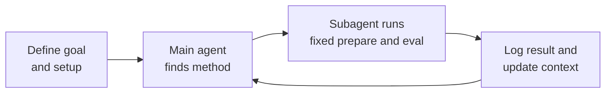

# Graduation Research Report Context

## Objective

Create a LaTeX report for the graduation research plan using the current repository state.
The report should look similar in spirit to `report/threshold/001/`, but focus on the
broader project plan rather than one isolated experiment.

## Required content

1. Overview and problem statement
2. Dataset summary with example images from `Dataset/`
3. Current methodology with full-size visuals
4. Current progress with existing result visualizations
5. Timeline and deep-dive plan for the next 6-8 weeks
6. Questions and system requirements to confirm with Miss Duong

## Repo-backed baseline metrics

- Fixed held-out retrieval accuracy: 83.3% with EfficientNetB1 finetuned
- Alternative finetuned CNNs: 78.6% with ResNet50 and MobileNetV2
- Best 5-fold strain-level CV mean in archive: 0.6542 using E1 + weighted(avg) + k=11
- Historical threshold best: F1 = 0.4587
- Refreshed threshold baseline in current log: F1 = 0.4000
- Diverse open-set dataset: 651 processed images, 45 species, 1,037 segmented colonies

## Required figures

- Dataset examples from `Dataset/`
- Existing preprocessing methodology image
- Existing retrieval methodology image
- New mermaid algorithm diagram for the autoresearch loop
- Existing model comparison figure
- Existing t-SNE feature-space figure
- Existing threshold staircase figure

## Mermaid diagram source

## Key file references

- `report/graduation_research_plan.md`
- `report/final_gr2/FINAL_REPORT.md`
- `report/final_gr2/training/FINETUNING_REPORT.md`
- `report/threshold/001/results.txt`
- `results/threshold/log/best_strategy.json`
- `results/cross_validation-20260331T081500Z-3-001.zip`
