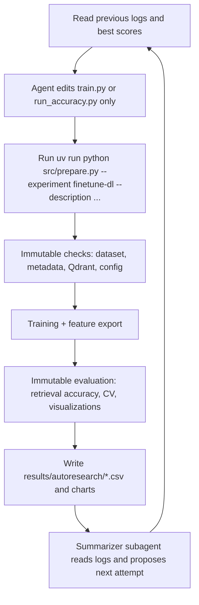

# Graduation Research Plan: Open-Set Fungal Classification and Autoresearch Workflow

_Prepared from the current repository state on 2026-04-09._

## 1. Overview

This graduation research project focuses on improving **fungal species classification from colony images**, with special emphasis on the harder **open-set setting**: the system must classify known species while rejecting previously unseen species.

The current repo already contains a strong technical base:

- a retrieval-based classification pipeline using **Qdrant**
- fine-tuned CNN feature extractors for fungal colony embeddings
- a threshold-based open-set experiment with **autoresearch logging** and staircase visualization
- preprocessing and segmentation pipelines for colony extraction
- report artifacts, confusion matrices, t-SNE plots, and experiment histories

The next research phase is to turn these separate achievements into one coherent graduation project with four connected outputs:

1. **Higher open-set classification score**
2. **A reusable autoresearch workflow** for finetuning and benchmarking
3. **Real-time experiment visualization** during runtime
4. **A client/server platform** for data management, search, and prediction

## 2. Timeline

The practical execution window is **6-8 weeks**, with the final deadline on **30 June**. The recommended plan uses **8 active weeks** and leaves remaining time as buffer for advisor feedback, thesis polishing, and demo preparation.

| Week | Main Goal | Deliverables | Weekly Report Focus |
|---|---|---|---|
| 1 | Freeze scope and current baselines | Canonical metric sheet, locked dataset versions, requirement questions for Miss Duong | Current status, baseline metrics, open risks |
| 2 | Prepare segmentation improvement track | YOLO/SAM annotation plan, cleaned label subset, segmentation benchmark protocol | Label quality, annotation progress |
| 3 | Train and compare segmentation baselines | KMeans vs contour vs YOLO/SAM-assisted results on labeled subset | Segmentation quality and downstream effect |
| 4 | Package finetuning into autoresearch workflow | Immutable `prepare/eval`, editable `train.py`, runtime logging and dashboard MVP | Workflow automation progress |
| 5 | Run low-cost finetuning autoresearch | EfficientNetB1 and MobileNetV2 search results, best configs, ablations | Accuracy gains and failed ideas |
| 6 | Explore advanced models and data expansion | ViT/CellViT/SimCLR pilots, augmentation study, external dataset transfer experiments | Which advanced direction is worth continuing |
| 7 | Build system/platform MVP | Upload-search-predict flow, metadata management, user stories, authentication draft | Product/demo readiness |
| 8 | Final benchmark and writing consolidation | Final comparison tables, figures, method chapter draft, demo checklist | Final evidence and remaining gaps |

### Weekly Reporting Rule

Each week should produce one concise report containing:

- objective of the week
- experiments run
- best metric vs previous week
- main failure cases
- next-week plan

## 3. Problem Statement

### Research Problem

The current system performs reasonably well on **closed-set retrieval-based classification**, but the graduation target is broader:

- improve **open-set classification** so unknown species can be rejected reliably
- make experimentation **systematic and reproducible** instead of manual trial-and-error
- reduce sensitivity to segmentation errors and noisy labels
- turn the research code into a usable workflow and platform

### Main Questions

1. How can segmentation quality be improved so downstream retrieval is more stable?
2. Which low-cost backbone gives the best trade-off between accuracy, speed, and maintainability?
3. Can an autoresearch loop outperform traditional manual parameter search for finetuning?
4. How can diverse/open-set data be used without hurting closed-set retrieval accuracy?
5. What system architecture is sufficient for a graduation demo without over-scoping the project?

### Success Criteria

- beat the current refreshed open-set baseline and recover or exceed the earlier best threshold result
- improve retrieval robustness under strain-level cross-validation
- package finetuning into an agent-ready experiment loop with logs and visualization
- deliver a working demo platform for search, prediction, and metadata management

## 4. Dataset

### 4.1 Current In-Repo Datasets

#### Original in-domain dataset

- **435** original Petri dish images
- **1,305** segmented colony images
- **8 Penicillium species**
- **24 training strains** and **7 held-out test strains** in the fixed evaluation split

This dataset is the core source for retrieval benchmarking and finetuning.

#### Diverse dataset for open-set evaluation

- **651** processed images from the reorganized diverse dataset
- **45 species**
- **1,037** segmented colonies
- used to test the **known vs unknown** threshold pipeline

This dataset is essential for open-set evaluation because it introduces visually similar but out-of-distribution fungal species.

### 4.2 Dataset Examples

<table>
  <tr>
    <td align="center">
       
      Original in-domain plate image
    </td>
    <td align="center">
       
      Segmented colony image
    </td>
    <td align="center">
       
      Diverse-data plate sample
    </td>
    <td align="center">
       
      Diverse-data segmented colony
    </td>
  </tr>
</table>

### 4.3 External Dataset Expansion Options

For a graduation timeline, public data should be treated mainly as **pretraining or regularization data**, not as a replacement for the in-domain fungal colony dataset.

| Dataset | Domain | Why it matters | Caveat | Priority |
|---|---|---|---|---|
| OpenFungi | Colony plate + microscopy | Includes macroscopic colonies and microscopic fungal images, with Penicillium present | broader genus-level setting, not exact lab setup | High |
| Singapore 518-strain fungal colony dataset | Colony plate | Useful for morphology pretraining and colony-level representation learning | domain shift in media, labels, and acquisition | High |
| DeFungi (UCI) | Microscopy | Large fungal microscopy dataset, practical for auxiliary transfer learning | not colony plates, different task framing | Medium-High |
| TgFC | Microscopy / spore detection | Useful for fungal texture pretraining and detection-style augmentation ideas | spore detection is not the same as colony retrieval | Medium |
| AGAR dataset | Agar plate imagery | Useful for self-supervised plate-image pretraining | bacterial rather than fungal | Medium |

### 4.4 Dataset Risks

- segmentation noise still propagates into retrieval and finetuning
- some labels still need manual verification and correction
- open-set score depends heavily on how the diverse dataset is versioned and filtered
- thesis figures should use one **locked dataset version** to avoid result drift

## 5. Current Progress

### 5.1 What Is Already Done

| Workstream | Current status | Evidence in repo |
|---|---|---|
| Retrieval methodology | Implemented retrieval pipeline with Qdrant, sibling filtering, weighted aggregation, and environment strategies | `src/experiments/retrieval/run.py`, `report/final_gr2/FINAL_REPORT.md` |
| Fine-tuned CNN backbones | ResNet50, MobileNetV2, EfficientNetB1 training and evaluation artifacts already exist | `report/final_gr2/training/FINETUNING_REPORT.md`, `src/experiments/finetune_dl/colab/` |
| Closed-set best result | Fine-tuned EfficientNetB1 reaches **83.3%** on the fixed held-out strain evaluation | `report/final_gr2/FINAL_REPORT.md` |
| Cross validation | 5-fold strain-level CV runner exists; archived outputs show best mean accuracy **65.4%** for **E1 + weighted(avg) + k=11** | `src/experiments/cross_validation/run.py`, `results/cross_validation-20260331T081500Z-3-001.zip` |
| Threshold autoresearch | Autoresearch logs, attempt history, best-strategy JSON, and staircase chart are already implemented | `src/run.py`, `src/experiments/threshold/`, `results/autoresearch/threshold.csv`, `results/threshold/log/` |
| Historical open-set best | Earlier threshold report reached **F1 = 0.4587** with `wtd_rat_halving + roc_opt` | `report/threshold/001/results.txt` |
| Refreshed open-set baseline | Refreshed segmented-diverse run currently sits around **F1 = 0.40** | `results/threshold/log/best_strategy.json` |
| Diverse dataset reorganization | Diverse dataset has already been reorganized and segmented | `report/eda_diverse_data/001/content.md` |
| Segmentation baseline | KMeans/contour pipelines and debug visualizations are implemented; YOLO-format export scaffolding already exists | `src/experiments/kmeans_segmentation/run.py`, `src/prepare/init_yolo.py` |
| Reporting gap | Some report content files are still placeholders even though experiment outputs already exist | `report/cross_validation/content.md`, `report/kmeans_segmentation/content.md` |

### 5.2 Key Quantitative Baselines

| Metric | Current best evidence |
|---|---|
| Fixed-split retrieval accuracy | **83.3%** with EfficientNetB1 fine-tuned |
| Alternative CNNs | **78.6%** with ResNet50 and MobileNetV2 fine-tuned |
| Historical open-set threshold F1 | **0.4587** |
| Refreshed open-set threshold F1 | **0.4000** |
| Best 5-fold CV mean accuracy | **0.6542** with `E1 + weighted(avg) + k=11` |
| Diverse dataset size | **651 images / 45 species / 1,037 segments** |

### 5.3 Retrieval Methodology Status

The retrieval pipeline is already a strong foundation for the thesis:

- image embeddings are stored in **Qdrant**
- each query strain is represented by multiple colony segments
- neighbors are aggregated across segments using a **weighted** similarity strategy
- sibling filtering helps avoid trivial leakage
- multiple environment-selection strategies are already implemented

This means the research does **not** need to start from zero. The next work is to improve the upstream segmentation and the embedding quality, then evaluate whether open-set rejection can be made reliable.

### 5.4 Segmentation Status

Current segmentation is still primarily a **heuristic baseline**:

- KMeans-based colony extraction is available
- contour-based extraction with step-by-step debugging is available
- YOLO-format export code already exists for bootstrapping a detection dataset

What is missing is a proper **deep-learning segmentation benchmark** with manually verified labels, IoU-style metrics, and downstream comparison against the current heuristic pipeline.

### 5.5 Cross Validation Status

The repo already has a proper **5-fold strain-level cross-validation runner**, which is important because the real problem is to predict species for a **new strain**, not a strain already seen during training.

Important current finding:

- the best archived mean CV result is **65.4%** with **E1 + weighted(avg) + k=11**
- this is weaker than the fixed 83.3% split result, so cross-validation remains a more difficult and more honest benchmark

This gap justifies using **cross-validation retrieval accuracy** as the main score for future autoresearch on finetuning.

### 5.6 Threshold / Open-Set Status

Open-set work is already one of the strongest research directions in the repo.

What is already good:

- formula-based threshold search has been automated
- every attempt is logged
- staircase charts already communicate improvement over time
- the experiment discovered one important bug early: label inversion caused false results, then the corrected setup jumped from about **0.09** to about **0.45** F1

What is still unfinished:

- the refreshed run currently reports about **0.40 F1**, below the earlier historical best **0.4587**
- false positives remain the main failure mode
- some threshold logs are inconsistent (`attempt_010.json` text vs `best_strategy.json`), so the evaluation version should be cleaned before thesis figures are frozen

### 5.7 UI / Platform Status

The repo contains many **visual outputs for prediction explanation** (correct/incorrect neighbor retrieval figures, confusion matrices, t-SNE plots), but it does **not yet contain a maintained client/server product stack**.

So for the graduation project, the platform should be treated as:

- **existing concept / partial prototype history**
- **not yet a finished repo-level deliverable**

This is good news for planning, because the work can be scoped clearly as an MVP rather than pretending it is already complete.

### 5.8 Current Visual Evidence

#### Closed-set model comparison

#### Feature-space clustering from fine-tuned embeddings

#### Threshold autoresearch staircase

## 6. Plans (Deep Dive)

### 6.1 Segmentation Improvement Plan

#### Why this matters

Poor segmentation introduces noisy colony crops, and that noise affects:

- feature extraction quality
- retrieval ranking quality
- threshold/open-set confidence
- trust in the final platform demo

#### Current baseline to keep

- KMeans and contour segmentation remain the **baseline** and fallback path
- they are also useful as **pseudo-label generators** for the first YOLO dataset

#### Proposed deep-learning path

1. Create a small **manually verified annotation subset** from current segmented data.
2. Fix obviously wrong labels and bounding boxes first.
3. Use `src/prepare/init_yolo.py` to bootstrap a YOLO-style dataset from existing pseudo-labels.
4. Train a **YOLO detection/segmentation baseline** for colony localization.
5. Use **SAM/SAM2** as an annotation-assist tool to refine masks or boxes more quickly.
6. Compare three pipelines:
   - KMeans / contour heuristic
   - YOLO-only detection
   - YOLO + SAM-assisted refinement
7. Evaluate both:
   - segmentation quality on labeled subset
   - downstream retrieval accuracy after re-segmentation

#### Recommended metrics

- annotation QC acceptance rate
- bbox IoU or Dice on labeled subset
- percentage of plates with 3 valid colonies extracted
- downstream retrieval accuracy change
- downstream threshold F1 change

#### Expected output

- a cleaner segmented dataset
- a clear statement about whether DL segmentation materially helps the classifier
- reusable labeled data for future work

#### Estimated effort

- **1.5-2 weeks** if label scope is controlled
- biggest risk: manual annotation taking longer than expected

### 6.2 Finetuning + Autoresearch Workflow Plan

#### Goal

Turn finetuning into a reproducible **agent-ready autoresearch experiment** instead of a collection of one-off training scripts.

One important cleanup task comes first: the current fine-tuning logic is split between local code and notebook-oriented Colab scripts, so it should be consolidated into one canonical experiment package before automation begins.

#### Why this is the best next target

The repo already proves that fine-tuning helps a lot:

- pretrained deep models: about **60-63%**
- fine-tuned CNNs: **78.6-83.3%**

So finetuning is already a validated direction. The next gain is likely to come from **better search over training choices**, not from starting a completely different methodology.

#### Recommended low-cost backbone strategy

| Model | Role in plan | Why |
|---|---|---|
| EfficientNetB1 | Primary research backbone | current best fixed-split result with reasonable compute cost |
| MobileNetV2 | Low-cost deployment baseline | lower parameter count with still-competitive accuracy |
| ResNet50 | Reference baseline | useful comparator, but not the cheapest |

Use **EfficientNetB1** to maximize quality, and keep **MobileNetV2** as the practical real-time deployment model.

#### Models to explore after the baseline is packaged

- stronger augmentation recipes
- loss changes: cross-entropy variants, focal loss, ArcFace/CosFace, CE + triplet hybrid
- optimizer/LR schedule changes
- image resolution and batch size search
- self-supervised initialization (SimCLR)
- microscopy-pretrained ViT variants only after CNN baselines are stable

#### Autoresearch packaging design

The workflow should separate **immutable evaluation** from **editable training logic**:

- `prepare.py` or equivalent:
  - dataset checks
  - split checks
  - Qdrant / feature-store prerequisites
  - fixed reporting hooks
- `eval.py` or equivalent:
  - fixed retrieval evaluation
  - cross-validation scoring
  - confusion matrix generation
  - threshold scoring if needed
- `train.py` or `run_accuracy.py`:
  - agent-editable training logic only
  - this is where the agent can try loss functions, optimizers, augmentations, and model variants

#### Proposed autoresearch loop

#### How to make the loop autonomous without losing control

- allow edits only inside the experiment folder
- keep dataset preparation and evaluation scripts read-only during runs
- require every run to include a short description string
- stop after a fixed budget, for example 10-20 attempts per batch
- auto-summarize `results/autoresearch/*.csv` and attempt logs after each batch
- auto-refresh charts during runtime for monitoring

#### Primary evaluation for this track

Use **retrieval accuracy under strain-level cross-validation** as the main metric.

Secondary metrics:

- fixed held-out split accuracy
- training time
- inference latency
- model size
- open-set threshold F1 after re-embedding

#### Comparison against traditional search

To justify the autoresearch contribution, compare:

- **manual or simple grid/random search** on a fixed hyperparameter menu
- **agentic autoresearch**, which can also change methodology, not just numeric values

Measure:

- best score reached
- number of trials needed
- human supervision time

#### Estimated effort

- packaging workflow: **1 week**
- running and analyzing main finetuning search: **1.5-2 weeks**

### 6.3 Model Improvement Plan

#### ViT exploration

The repo already contains a useful warning: ViT performed poorly on small data before heavy augmentation, and even after strong augmentation it still trails the best CNN result.

So the correct thesis position is:

- **ViT is a research track, not the primary baseline**
- it should be explored only after the CNN pipeline is stable

#### Recommended advanced directions

1. **SimCLR self-supervised pretraining** on all segmented colony images
2. **CellViT / microscopy-pretrained ViT** if pretrained weights are available
3. **CNN + metadata hybrid** using timestamp, environment, and expert notes
4. **Vision-language extension** only if expert textual descriptions become available in a structured way

#### Metadata fusion idea

If metadata quality is sufficient, combine image embedding with:

- environment / medium
- timestamp or growth stage
- expert free-text descriptions
- strain notes from the lab

Recommended first step: simple **late fusion or reranking**, not a heavy end-to-end multimodal model.

#### When to use the diverse dataset for training

The diverse dataset should be added gradually, with a gate:

- first, improve open-set threshold behavior on the refreshed baseline
- then test whether diverse-data pretraining helps closed-set retrieval
- only keep it if both closed-set and open-set metrics stay stable or improve

#### Estimated effort

- **1-1.5 weeks** for controlled pilot experiments
- this is a stretch area if the 6-week version is needed

### 6.4 System Improvement Plan

#### Goal

Deliver a client/server platform that supports:

- managing images and metadata
- searching similar colony images
- classifying newly uploaded samples
- monitoring experiment progress and results

#### Recommended MVP scope

Backend:

- API for upload, search, prediction, metadata CRUD
- connection to Qdrant for vector retrieval
- relational store for metadata and users (SQLite first, Postgres if needed)
- experiment status endpoint that reads log files and result CSVs

Frontend:

- upload image / strain package
- search by species, strain, environment, date, and keyword
- prediction page showing top neighbors and confidence
- experiment dashboard with live status and charts

#### Requirement questions for Miss Duong

1. Who are the main users: researcher, lab technician, manager, or external collaborator?
2. What metadata fields are mandatory when uploading a new sample?
3. Should users approve predictions manually before storing them?
4. Is unknown-species rejection required in the UI, or only in research evaluation?
5. Are authentication and user roles required for the graduation demo, or only for future deployment?
6. Does the system need to import data from another lab database or external API?
7. What search workflows matter most: search by metadata, by image similarity, or by both?

#### Suggested user stories

- As a lab user, I can upload a new plate image and receive the predicted species plus top similar historical cases.
- As a researcher, I can inspect the retrieved neighbors and see why the model made that prediction.
- As a manager, I can search historical data by species, strain, medium, or date.
- As an admin, I can correct metadata and labels without touching raw files manually.
- As a researcher, I can monitor running experiments and compare the newest score with the best score so far.

#### Real-time visualization plan

The repo already writes logs and result tables. The dashboard should stream:

- current experiment status
- latest attempt description
- current best score
- staircase chart refresh
- stdout / error logs

This can be built from existing result files instead of inventing a new tracking system.

#### Estimated effort

- **1.5-2 weeks** for an MVP
- biggest risk: scope creep from authentication and external integration

## 7. Recommended Scope Control

### If the project must fit in 6 weeks

Keep these as **must-have**:

- segmentation label cleanup + one DL segmentation baseline
- finetuning autoresearch workflow packaging
- closed-set and open-set benchmark refresh
- simple client/server MVP

Move these to **stretch goals**:

- extensive ViT experiments
- full authentication and role management
- external database/API integration
- large-scale multimodal metadata fusion

### If the project can use the full 8 weeks

Add:

- SimCLR or CellViT pilot
- better dashboard polish
- more complete weekly reporting automation
- stronger system demo with user roles and audit trail

## 8. Final Recommended Deliverables

By the end of the graduation project, the repo should clearly contain:

1. a reproducible **open-set benchmark** with locked dataset version
2. a packaged **autoresearch workflow** for finetuning experiments
3. a comparison of **heuristic vs DL segmentation**
4. a documented comparison of **manual search vs autoresearch**
5. a **client/server demo** for upload, search, and prediction
6. weekly reports and final summary figures ready for the thesis

## 9. Practical Conclusion

This project is already beyond the idea stage. The repo shows real progress in retrieval, fine-tuning, thresholding, and data preparation. The best strategy now is **not** to restart with a new model family immediately.

The highest-value order is:

1. lock the current metrics and dataset versions
2. improve segmentation quality
3. package finetuning into autoresearch
4. push open-set performance with better embeddings and cleaner data
5. deliver the client/server demo around the already-working retrieval core

That path is realistic for a **6-8 week graduation timeline** and stays grounded in what this repo has already proven.
