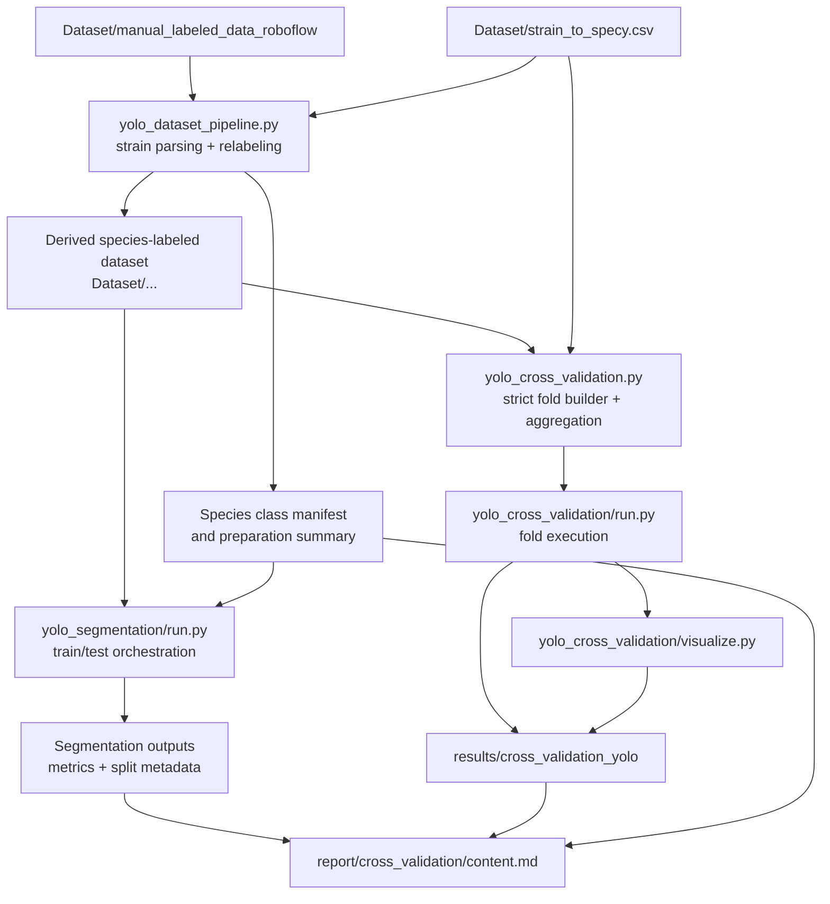

# Component Diagram: YOLO Dataset Pipeline

**Feature**: Species-labeled YOLO dataset preparation plus segmentation train/test and strain-held-out classification cross validation  
**Generated**: 2026-04-22  
**Last updated**: 2026-04-22  
**Scope**: Full feature

---

## Overview

This diagram shows the feature as a set of experiment-side components inside `fungal-cv-qdrant`, plus the shared dataset and results boundaries at the monorepo root. It focuses on how source labels become species-labeled training artifacts, then fan out into segmentation and cross-validation workflows before converging in a single report surface.

## Component Diagram

## Component Breakdown

### `Dataset/manual_labeled_data_roboflow`

**Role**: Provides the raw image/label pairs and existing split layout that seed the whole workflow.

**Why this exists as a separate component**: The source dataset is an external input boundary, not implementation logic. Keeping it separate makes it clear that the feature transforms existing labeled artifacts rather than redefining them in code.

**Key interactions**:
- → `yolo_dataset_pipeline.py`: supplies filenames, images, labels, and split membership

---

### `Dataset/strain_to_specy.csv`

**Role**: Acts as the canonical mapping from normalized strain IDs to species names.

**Why this exists as a separate component**: The plan and research make this the single source of species truth. Separating it prevents fallback logic from silently inventing labels from folder names or other weaker heuristics.

**Key interactions**:
- → `yolo_dataset_pipeline.py`: provides species labels for relabeling
- → `yolo_cross_validation.py`: provides the strain/species universe for deterministic fold construction

---

### `yolo_dataset_pipeline.py`

**Role**: Centralizes DTO parsing, strain normalization, species relabeling, manifest generation, and preparation summaries.

**Why this exists as a separate component**: This logic is shared by both downstream experiment paths. If it were embedded directly into segmentation or cross-validation runners, the mapping rules could drift and produce inconsistent datasets.

**Key interactions**:
- ← `Dataset/manual_labeled_data_roboflow`: reads source samples
- ← `Dataset/strain_to_specy.csv`: reads authoritative species mapping
- → Derived species-labeled dataset: writes transformed labels and preserved split layout
- → Species class manifest and preparation summary: writes shared metadata consumed later

---

### Derived species-labeled dataset

**Role**: Stores the transformed YOLO dataset with stable species class IDs and unchanged annotation geometry.

**Why this exists as a separate component**: The feature deliberately separates dataset preparation from training so researchers can inspect intermediate artifacts before running experiments. That matches the spec requirement that each step be runnable independently.

**Key interactions**:
- ← `yolo_dataset_pipeline.py`: receives transformed images/labels
- → `yolo_segmentation/run.py`: supplies train/test-ready inputs for segmentation
- → `yolo_cross_validation.py`: supplies classification-ready samples or metadata for fold execution

---

### Species class manifest and preparation summary

**Role**: Captures stable class indices plus skipped/failed sample diagnostics.

**Why this exists as a separate component**: The manifest is the contract that keeps class IDs stable across preparation, training, and reporting. The summary is separate because debugging bad mappings is operationally different from consuming training data.

**Key interactions**:
- ← `yolo_dataset_pipeline.py`: generated during preparation
- → `yolo_segmentation/run.py`: provides label identity context
- → `report/cross_validation/content.md`: supplies provenance and data-quality evidence

---

### `yolo_segmentation/run.py`

**Role**: Materializes the no-validation train/test segmentation workflow and records split-aware metrics.

**Why this exists as a separate component**: Segmentation has a different split rule from classification. Keeping it separate avoids burying random train/test behavior inside a general training abstraction that would blur the distinction the user explicitly asked for.

**Key interactions**:
- ← Derived species-labeled dataset: consumes prepared samples
- ← Species class manifest and preparation summary: uses stable label metadata
- → Segmentation outputs: writes metrics and split metadata

---

### `yolo_cross_validation.py`

**Role**: Owns strict fold-definition building, held-out strain validation, and aggregate result writing.

**Why this exists as a separate component**: The research notes that existing cross-validation code allows repeated strains when species counts are small. This stricter fold policy needs a dedicated module so the rule is explicit and testable.

**Key interactions**:
- ← `Dataset/strain_to_specy.csv`: uses the canonical mapping to build folds
- ← Derived species-labeled dataset: uses prepared data semantics
- → `yolo_cross_validation/run.py`: passes validated fold definitions
- → `results/cross_validation_yolo`: writes aggregate summaries and split metadata

---

### `yolo_cross_validation/run.py`

**Role**: Executes training/evaluation for each fold using the held-out strain assignments.

**Why this exists as a separate component**: Execution concerns are different from fold-definition concerns. Splitting them keeps the fold policy reusable and makes failures easier to localize when either split construction or model execution goes wrong.

**Key interactions**:
- ← `yolo_cross_validation.py`: receives fold definitions and summary-writing helpers
- → `results/cross_validation_yolo`: writes fold metrics and evaluation artifacts
- → `yolo_cross_validation/visualize.py`: supplies fold outputs to be visualized

---

### `yolo_cross_validation/visualize.py`

**Role**: Turns fold outputs into comparison views that make train/test behavior interpretable.

**Why this exists as a separate component**: Visualization is analysis logic, not training logic. Isolating it keeps experiment execution focused on producing correct results while making reporting visuals independently evolvable.

**Key interactions**:
- ← `yolo_cross_validation/run.py`: receives fold-level outcomes
- → `results/cross_validation_yolo`: writes figures for analysis and reporting

---

### `results/cross_validation_yolo`

**Role**: Serves as the durable analysis boundary for fold definitions, aggregate CSVs, and visual summaries.

**Why this exists as a separate component**: The feature explicitly requires a dedicated output location instead of mixing YOLO classification results into legacy retrieval CSVs. That separation keeps evaluation lineage clean.

**Key interactions**:
- ← `yolo_cross_validation.py`: receives aggregate summaries and split metadata
- ← `yolo_cross_validation/run.py`: receives fold outputs
- ← `yolo_cross_validation/visualize.py`: receives comparison figures
- → `report/cross_validation/content.md`: supplies report-ready evidence

---

### `report/cross_validation/content.md`

**Role**: Consolidates dataset provenance, segmentation outcomes, cross-validation outcomes, and referenced artifacts into a readable experiment narrative.

**Why this exists as a separate component**: The report is the handoff surface for reviewers. Keeping it separate from execution code ensures the final explanation can connect both workflows without coupling narrative structure to runner internals.

**Key interactions**:
- ← Segmentation outputs: consumes train/test metrics and metadata
- ← `results/cross_validation_yolo`: consumes aggregate CSVs and figures
- ← Species class manifest and preparation summary: consumes provenance and quality details

---

## Design Reasoning

### Why this structure?

The structure follows the plan’s decision to keep all logic inside `fungal-cv-qdrant` while treating root `Dataset/` and `results/` paths as shared artifacts rather than code locations. The decomposition also reflects the research decision to separate segmentation and classification into two workflows because they use materially different split rules: random train/test for segmentation and strict held-out-strain folds for classification. Finally, shared relabeling and fold-policy modules exist because the spec requires each step to be runnable independently and because class identity and fold correctness must remain stable across preparation, execution, and reporting.

### Alternatives considered

| Structure | Why it wasn't chosen |
|-----------|---------------------|
| One combined YOLO runner that prepares data, trains segmentation, runs cross validation, and writes the report | Rejected because the research explicitly calls out split-rule differences and the spec requires separable steps with inspectable intermediate artifacts. |
| Reusing the existing cross-validation module unchanged | Rejected because the current round-robin behavior can repeat strains and does not enforce the stricter held-out-strain rule required by this feature. |
| Inferring species directly from dataset folders instead of a dedicated mapping path | Rejected because the research chooses `Dataset/strain_to_specy.csv` as the canonical source of truth. |

### When you'd restructure

If classification and segmentation begin sharing a larger common training abstraction beyond data preparation, the two runner modules could sit behind a higher-level experiment coordinator. If the report grows into multiple reusable analysis views, `content.md` would likely split into separate segmentation and cross-validation report components with a thin top-level summary.
